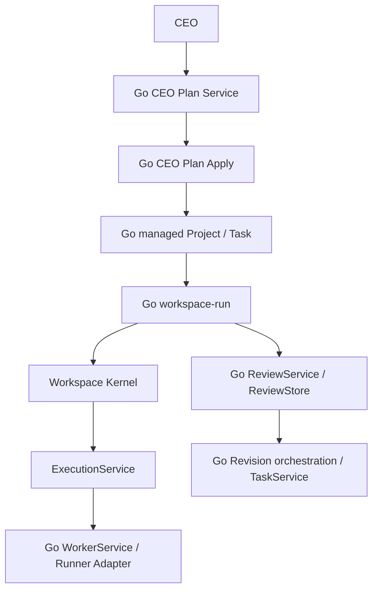

# Workspace OS

## Workspace OSとは

Workspace OSは、Obsidian Vaultをデータストアとして、AI社員・プロジェクト・タスク実行・レビュー・修正フローを管理します。現在の通常Task実行入口はGo Workspace Kernel上の`workspace-run`です。

v0.1.0 Python APIは公開互換専用のcompatibility surfaceとして残ります。既存importと`workspace-ai` entry pointは維持しますが、通常製品Runtimeではありません。正本のGo実行経路は実行前plan、明示的承認、Version/CAS、immutable Deliverable、Task lifecycle Event Auditを組み合わせ、人間が確認できるMarkdownを維持します。全体像は[System Overview](docs/SystemOverview.md)、HTTP入口は[HTTP Command API](docs/HTTPAPI.md)、判定根拠は[Go Only Release Gate](docs/GoOnlyReleaseGate.md)、残存Python callerと削除条件は[Python Runtime Inventory](docs/PythonRuntimeInventory.md)を参照してください。

## 特徴

- 社員Markdownを正とする組織・AI社員管理
- Workspace Managerと予約済みIDを含む全組織Identity診断
- 社員IDによるタスク割り当てと存在確認
- Project.md、Tasks.md、Decisions.md、Progress.mdによるプロジェクト管理
- Go ExecutionServiceによる1タスク単位の安全な実行
- WorkerService、PromptBuilder、Runner Registry、Runner Adapterを分離した実行パイプライン
- Go Claude AdapterとFake Runner／Mock HTTP serverの差し替え
- 別AI社員による構造化レビューと修正タスク生成
- Go process／Serviceによる実行・レビュー・修正フローの調整
- dry-run、明示的承認、二重実行防止、原子的更新、partial failureの明示
- commit済み証拠とTask Versionに拘束されたread-only診断／明示Recovery
- 社員IDを維持した安全な改名とIdentity履歴

## Architecture



各層の責務とデータ境界は[docs/Architecture.md](docs/Architecture.md)を参照してください。Mermaidソースは[docs/architecture.mmd](docs/architecture.mmd)にあります。

## Architecture Decisions

長期的な設計判断は[docs/adr/](docs/adr/)のArchitecture Decision Record（ADR）で管理します。

- [ADR-0001: GoをWorkspace OSの中核実装とする](docs/adr/ADR-0001-go-core.md)
- [ADR-0002: PythonとGo CoreをJSON Contractで疎結合にする](docs/adr/ADR-0002-json-contract.md)
- [ADR-0003: Workspace Kernelを中心コンポーネントとする](docs/adr/ADR-0003-workspace-kernel.md)
- [ADR-0004: Event DrivenをWorkspace OSの基本設計とする](docs/adr/ADR-0004-event-system.md)
- [ADR-0005: Task lifecycleをGo TaskServiceの責務とする](docs/adr/ADR-0005-task-lifecycle.md)
- [ADR-0006: WorkerとRunnerをProvider非依存の境界で分離する](docs/adr/ADR-0006-worker-runner-boundary.md)
- [ADR-0007: Workflow executionとPolicyをTask lifecycleから分離する](docs/adr/ADR-0007-workflow-execution-policy.md)
- [ADR-0008: Tasks.mdの5列表とmanaged metadataを同一ファイルで永続化する](docs/adr/ADR-0008-vault-taskstore-metadata.md)
- [ADR-0009: DeliverableをTask完了より先にcommitする](docs/adr/ADR-0009-deliverable-commit-ordering.md)
- [ADR-0010: Review JSONをhuman-readable Markdownより先にcommitする](docs/adr/ADR-0010-review-artifact-commit-ordering.md)
- [ADR-0011: Review factをcanonical JSON commit後にEventとして発行する](docs/adr/ADR-0011-review-fact-event-ordering.md)
- [ADR-0012: Revision intentをTask作成より先にcommitする](docs/adr/ADR-0012-revision-intent-commit-ordering.md)
- [ADR-0013: Projectをdirectory単位でbootstrapしTask作成をTaskServiceへ集約する](docs/adr/ADR-0013-project-bootstrap-and-task-creation.md)
- [ADR-0014: Employee MarkdownをWorkspace State projectionより先にcommitする](docs/adr/ADR-0014-employee-hire-commit-ordering.md)
- [ADR-0015: Employee rename intentを先行保存しfile renameをIdentity commit pointとする](docs/adr/ADR-0015-employee-rename-intent-and-commit.md)
- [ADR-0016: Employee ID repair intentを先行保存しEmployee Markdownを順次commitする](docs/adr/ADR-0016-employee-id-repair-commit-ordering.md)
- [ADR-0017: Employee rename batchは全件preflight後に単一rename commitを順次調停する](docs/adr/ADR-0017-employee-rename-batch-composition.md)
- [ADR-0018: CEO plan applyはProject、Task、Dependency projectionを順次commitする](docs/adr/ADR-0018-ceo-plan-apply-commit-ordering.md)
- [ADR-0019: CEO plan生成と適用をGo typed contractで分離する](docs/adr/ADR-0019-ceo-plan-generation-and-cutover.md)
- [ADR-0020: 確定証拠に拘束された診断と明示Recoveryを先行する](docs/adr/ADR-0020-explicit-recovery-foundation.md)
- [ADR-0021: Command claimを副作用より先にcommitし同一IDの再送を判定する](docs/adr/ADR-0021-command-ledger-claim-before-effects.md)
- [ADR-0022: version付き同期Command APIをGo daemonの最初の外部入口とする](docs/adr/ADR-0022-versioned-http-command-api-and-daemon.md)
- [ADR-0023: Multi-task Workflowは再planする順次Task commandとして構成する](docs/adr/ADR-0023-sequential-workflow-command-composition.md)
- [ADR-0024: Reviewed Workflowは既存Task、Review、Revision commandを決定的に構成する](docs/adr/ADR-0024-reviewed-workflow-branch-composition.md)
- [ADR-0025: Schedulerは承認済みone-shot CommandをLedger経路へ配送する](docs/adr/ADR-0025-one-shot-scheduler-command-dispatch.md)

新しいADRは[ADRテンプレート](docs/adr/ADR-template.md)から作成します。

## ディレクトリ構成

```text
workspace-os/
├── docs/
│   ├── adr/
│   ├── SystemOverview.md
│   ├── Recovery.md
│   ├── Architecture.md
│   ├── CONSTITUTION.md
│   ├── ROADMAP.md
│   ├── GoOnlyReleaseGate.md
│   └── PythonRuntimeInventory.md
├── go/
│   ├── cmd/workspace-core/
│   ├── cmd/workspace-run/
│   └── internal/
│       ├── adapter/
│       ├── kernel/
│       ├── service/
│       ├── runtime/
│       └── <domain packages>/
├── fixtures/
├── src/workspace_ai/
│   ├── compatibility.py
│   ├── workspace_run_gateway.py
│   └── <v0.1 legacy/reference modules>/
├── tests/
├── Makefile
├── pyproject.toml
└── README.md
```

Obsidian Vault側では、次の構成を使用します。

```text
Vault/
├── 会社/
│   ├── Workspace State.md
│   └── Identity History.md
├── 社員/
│   └── <社員名>.md
└── プロジェクト/
    └── <プロジェクト名>/
        ├── Project.md
        ├── Tasks.md
        ├── Decisions.md
        ├── Progress.md
        ├── Deliverables/
        ├── Reviews/
        └── Revisions/
```

## Build

製品RuntimeにはGo 1.23以上を使用します。

```bash
git clone <repository-url> workspace-os
cd workspace-os
make go-build
```

公開Python v0.1 compatibility APIを利用・検証する場合だけ、Python 3.9以上と[uv](https://docs.astral.sh/uv/)で`uv sync`を実行します。

## Claude API設定

Go `workspace-run`は`.env`を自動読込しません。Providerを使う承認済みcommandに限り、process環境から`ANTHROPIC_API_KEY`等を受け取ります。次の`.env`形式はPython v0.1 legacy compatibility向けだけです。

```dotenv
WORKSPACE_VAULT_PATH=/absolute/path/to/your/obsidian/vault
ANTHROPIC_API_KEY=your-anthropic-api-key
```

`.env`とAPIキーはGitへコミットしないでください。Go `workspace-run`は`.env`を自動読込せず、execute時だけprocess環境の`ANTHROPIC_API_KEY`を読み取ります。

## 初回セットアップ

1. Obsidian Vault内に`会社`、`社員`、`プロジェクト`フォルダを作成します。
2. `会社/Workspace State.md`へ`## Workspace Manager`と`## 部署`セクションを用意します。
3. 社員MarkdownのFront Matterへ`id`、`department`、`role`、`model`、`status`を設定します。
4. `workspace-run organization-inspect`と`identity-validate`で社員データを検査します。
5. `organization-sync-plan`を確認し、`organization-sync-execute --approved`で社員一覧と部署一覧を同期します。
6. 初回の実AI実行前にdry-run結果とバックアップ対象を確認します。

社員Markdownの例：

```markdown
---
id: PLAN-001
department: 企画部
role: Product Manager
model: Claude Sonnet 5
status: 待機中
---

# 山本 真帆
```

## 実行方法

### Go通常Task実行をplanする

`make go-build`は既存JSON Contract v1用`bin/workspace-core`と、通常Task運用入口`bin/workspace-run`を生成します。planはVaultを変更せず、Provider設定やAPIキーも読みません。

metadata未導入の既存5列`Tasks.md`は、先にmigration planをファイルへ保存し、その同じplanを明示承認付きapplyへ渡します。apply時に元ファイルが変わっていれば拒否されます。

```bash
bin/workspace-run migrate-plan \
  --vault /absolute/path/to/vault \
  --project "新規プロジェクト" > migration-plan.json

bin/workspace-run migrate-apply \
  --vault /absolute/path/to/vault \
  --project "新規プロジェクト" \
  --plan-file migration-plan.json \
  --approved
```

```bash
bin/workspace-run plan \
  --vault /absolute/path/to/vault \
  --project-id PROJECT-001 \
  --project "新規プロジェクト" \
  --task TASK-001
```

Go executeはADR-0008 managed metadataへのmigrationが完了したTaskだけを対象とし、`--approved`がなければProvider設定を読む前に拒否します。`.env`は自動読込せず、process環境からProvider設定を受け取ります。

```bash
ANTHROPIC_API_KEY=... \
WORKSPACE_CLAUDE_PROVIDER_MODEL=claude-sonnet-5 \
bin/workspace-run execute \
  --vault /absolute/path/to/vault \
  --project-id PROJECT-001 \
  --project "新規プロジェクト" \
  --task TASK-001 \
  --command-id CMD-20260808-001 \
  --approved \
  --approval-reference "human-approval-id"
```

実行前にplan結果、対象Vault、Task ID、既存Deliverableの有無を確認してください。

主要な副作用commandで`--command-id`を指定すると、request digestとterminal outcomeを永続化します。同じID・同じrequestの再送は処理を繰り返さず保存済みresultを返し、異なるrequestは拒否します。Project作成前／Organization commandはworkspace scope、既存Project内commandはproject scopeです。`running`のまま残ったcommandは自動再開せず、`recovery-inspect`で確認してください。既存互換のためID未指定実行も可能ですが、durableな再送保証はありません。

### GoでProjectと通常Taskを作成する

Project bootstrapは最初からADR-0008 managed Tasks.mdを作成し、Task追加はTaskServiceとAuditを通ります。planはread-only、executeは`--approved`必須です。

```bash
bin/workspace-run project-bootstrap-plan --vault /absolute/path/to/vault --project-id PROJECT-001 --project "新規プロジェクト" --description "概要"
bin/workspace-run project-bootstrap-execute --vault /absolute/path/to/vault --project-id PROJECT-001 --project "新規プロジェクト" --description "概要" --approved
bin/workspace-run task-create-plan --vault /absolute/path/to/vault --project "新規プロジェクト" --title "要件を整理する" --assignee PLAN-001
bin/workspace-run task-create-execute --vault /absolute/path/to/vault --project "新規プロジェクト" --title "要件を整理する" --assignee PLAN-001 --approved
```

Python callerとの互換境界には`WorkspaceRunOrganizationGateway`、`WorkspaceRunRecruiterGateway`、`WorkspaceRunProjectGateway`を使用します。Managerのbatch採用は候補全体をGoで検査してから単一EmployeeをGo writerで順次作成します。Python `Organization`、`Recruiter`のwriterと`ProjectManager`は公開互換legacyです。

### GoでCEO planを生成・適用する

`ceo-plan-generate`は明示承認後だけProviderを呼び、Organization inventoryからversion付きresponse内のtyped planを返します。適用前にはread-only planを確認し、別の明示承認でProject IDを指定します。正式なTask IDはGo Task Domainが発行し、LLM出力をそのままVaultへ書きません。

```bash
ANTHROPIC_API_KEY=... \
WORKSPACE_CLAUDE_PROVIDER_MODEL=claude-sonnet-5 \
bin/workspace-run ceo-plan-generate \
  --vault /absolute/path/to/vault \
  --request "家計簿Webアプリを計画する" \
  --model "Claude Sonnet 5" \
  --approved > ceo-plan.json

bin/workspace-run ceo-plan-apply-plan \
  --vault /absolute/path/to/vault \
  --project-id PROJECT-001 \
  --plan-json '<確認済みresult.planのJSON>'

bin/workspace-run ceo-plan-apply \
  --vault /absolute/path/to/vault \
  --project-id PROJECT-001 \
  --plan-json '<確認済みresult.planのJSON>' \
  --approved
```

生成と適用は分離されます。Provider出力は未知field、未知社員、循環dependencyなどをGoで拒否します。Project、Task、Task Dependenciesの途中失敗では成立済みfactを削除せず、partial stateを返します。公開Python caller向け`WorkspaceRunCEOPlanGateway`／`WorkspaceRunCEOApplyGateway`にもPython fallbackはありません。

### Partial stateを診断・明示Recoveryする

process停止やpartial failure後は、まずProject単位のread-only inventoryを確認します。安全性を証明できる進行中Taskだけ、version付きplanと別の明示承認でCompleteまたはFail／Holdできます。

```bash
bin/workspace-run recovery-inspect --vault /absolute/path/to/vault --project "新規プロジェクト"
bin/workspace-run recovery-plan --vault /absolute/path/to/vault --project "新規プロジェクト" \
  --task TASK-001 --action complete_task > recovery-plan.json
bin/workspace-run recovery-apply --vault /absolute/path/to/vault --project "新規プロジェクト" \
  --plan-file recovery-plan.json --approved
```

plan後にartifact、Task Version、理由が変わった場合はstaleとして拒否します。Audit欠落、Review Markdown欠落、Revision intentだけの状態、temporary残存は診断しますが、Event replay、再生成、adoption、削除を推測で行いません。詳細は[Recovery](docs/Recovery.md)を参照してください。

### Python legacy API（reference）

```python
from workspace_ai.organization import Organization
from workspace_ai.project_manager import ProjectManager

organization = Organization()
projects = ProjectManager(organization)

projects.create_project("新規プロジェクト", "プロジェクト概要")
projects.add_task("新規プロジェクト", "要件を整理する", "PLAN-001")
```

### Python legacy TaskExecutorについて

`workspace_ai.task_executor.TaskExecutor`、Python Worker、ModelRouter、ClaudeRunnerは公開Python API互換性とreference testのため残していますが、通常Taskの製品実行入口ではありません。通常運用は上記`workspace-run plan|execute`を使用してください。Python `WorkflowEngine`からReviewを続ける場合も、通常Task executionには`WorkspaceRunExecutionGateway`を明示注入し、Go失敗時のPython fallbackは行いません。`revision_task_service=`も公開互換aliasに限定し、ADR-0008 managed Tasks.mdへは使用しません。

### テストする

```bash
uv run python -m unittest discover -s tests -v
uv run python -m compileall -q src tests
```

テストはFake RunnerまたはMock APIクライアントを使用します。テスト実行だけでは実AI APIや実Vaultのタスクを実行しません。

通常製品Runtimeのrelease gateはPythonを使わず実行できます。

```bash
make go-only-release-gate
```

Go製品Runtimeに加えて公開Python compatibility、lockfile、compile、差分衛生まで含むv1.0候補gateは次です。

```bash
make v1-release-gate
```

## AI社員の仕組み

通常Task executionはGoで次の順序を通ります。

1. Vault Context Adapterが社員ID、Project、Taskを構造化Contextへ変換します。
2. Go PromptBuilderが通常Task Promptを構築します。
3. Runner Registryが社員の論理model値をGo Claude Adapterへ解決します。
4. ExecutionServiceがTaskService、DeliverableStore、Policyを調停します。
5. Task lifecycle EventをAudit subscriberが保存します。

Python Worker／PromptBuilder／ModelRouter／ClaudeRunnerは通常Task経路から外れています。Reviewは`workspace-run review-plan|review-execute`、Revisionは`workspace-run revision-plan|revision-execute`を通り、Python ReviewerWorkerとRevisionTaskServiceは公開互換reference／legacyだけに残ります。RevisionはADR-0012のintent先行commit、TaskService.Create、`revision.created`、Audit subscriberの順で確定します。

社員名は表示情報、社員IDは永続的な参照です。タスク、レビュー、修正タスクは氏名ではなく社員IDで担当者を保持します。詳細は[docs/IdentityPolicy.md](docs/IdentityPolicy.md)を参照してください。

## Python compatibility workflow

公開v0.1互換のWorkflowEngineは、Go gatewayを通して最初の未着手タスクを1件だけ調整します。これは製品Runtimeではありません。

```text
未着手タスク取得
  → WorkspaceRunExecutionGatewayからGo workspace-runで実行
  → WorkspaceRunReviewGatewayからGo Reviewでレビュー
  → Approveなら次タスクを返す
  → Request ChangesならWorkspaceRunRevisionGatewayからGo Revisionへ委譲
```

従来の`task_executor=`、`reviewer_worker=`、`revision_task_service=`は公開Python API互換aliasです。通常製品構成では3つのWorkspaceRun gatewayを注入し、Go失敗時にPython legacyへfallbackしません。

途中で失敗した場合は後続処理を停止し、各コンポーネントが確定した状態を保持してWorkspace Managerへ返します。詳細は[docs/Workflow.md](docs/Workflow.md)と[docs/ReviewFlow.md](docs/ReviewFlow.md)を参照してください。

## Roadmap

現在はGo Only Runtime、v1.0候補安定化、Durability／Recovery、主要commandへのLedger適用、loopback HTTP API／daemon、Reviewed Multi-task Workflow、one-shot Schedulerまで完了しています。次は通知／Metrics、外部Action Adapterへ進みます。順序と完了条件は[docs/ROADMAP.md](docs/ROADMAP.md)を参照してください。

## ライセンス

[MIT License](LICENSE)
