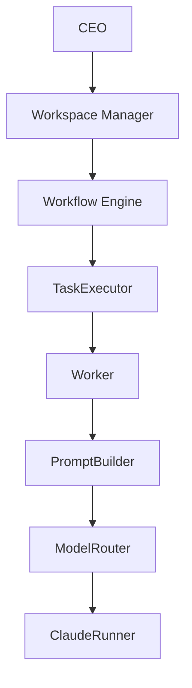

# Workspace OS

## Workspace OSとは

Workspace OSは、Obsidian Vaultをデータストアとして、AI社員・プロジェクト・タスク実行・レビュー・修正フローを管理するPythonアプリケーションです。

v0.1.0はPython APIを中心とした初期リリースです。実行前検証、dry-run、明示的承認、原子的ファイル更新を組み合わせ、人間が確認できるMarkdownを正としてAIワークフローを運用します。

## 特徴

- 社員Markdownを正とする組織・AI社員管理
- Workspace Managerと予約済みIDを含む全組織Identity診断
- 社員IDによるタスク割り当てと存在確認
- Project.md、Tasks.md、Decisions.md、Progress.mdによるプロジェクト管理
- TaskExecutorによる1タスク単位の安全な実行
- Worker、PromptBuilder、ModelRouter、Runnerを分離した実行パイプライン
- ClaudeRunnerとFake Runner／Mockクライアントの差し替え
- 別AI社員による構造化レビューと修正タスク生成
- WorkflowEngineによる実行・レビュー・修正フローの調整
- dry-run、明示的承認、二重実行ロック、原子的更新、失敗時ロールバック
- 社員IDを維持した安全な改名とIdentity履歴

## Architecture



各層の責務とデータ境界は[docs/Architecture.md](docs/Architecture.md)を参照してください。Mermaidソースは[docs/architecture.mmd](docs/architecture.mmd)にあります。

## Architecture Decisions

長期的な設計判断は[docs/adr/](docs/adr/)のArchitecture Decision Record（ADR）で管理します。

- [ADR-0001: GoをWorkspace OSの中核実装とする](docs/adr/ADR-0001-go-core.md)
- [ADR-0002: PythonとGo CoreをJSON Contractで疎結合にする](docs/adr/ADR-0002-json-contract.md)
- [ADR-0003: Workspace Kernelを中心コンポーネントとする](docs/adr/ADR-0003-workspace-kernel.md)
- [ADR-0004: Event DrivenをWorkspace OSの基本設計とする](docs/adr/ADR-0004-event-system.md)
- [ADR-0005: Task lifecycleをGo TaskServiceの責務とする](docs/adr/ADR-0005-task-lifecycle.md)
- [ADR-0006: WorkerとRunnerをProvider非依存の境界で分離する](docs/adr/ADR-0006-worker-runner-boundary.md)
- [ADR-0007: Workflow executionとPolicyをTask lifecycleから分離する](docs/adr/ADR-0007-workflow-execution-policy.md)

新しいADRは[ADRテンプレート](docs/adr/ADR-template.md)から作成します。

## ディレクトリ構成

```text
workspace-os/
├── docs/
│   ├── adr/
│   │   ├── ADR-0001-go-core.md
│   │   ├── ADR-0002-json-contract.md
│   │   ├── ADR-0003-workspace-kernel.md
│   │   ├── ADR-0004-event-system.md
│   │   ├── ADR-0005-task-lifecycle.md
│   │   ├── ADR-0006-worker-runner-boundary.md
│   │   ├── ADR-0007-workflow-execution-policy.md
│   │   └── ADR-template.md
│   ├── Architecture.md
│   ├── IdentityPolicy.md
│   ├── ReviewFlow.md
│   ├── Workflow.md
│   ├── architecture.mmd
│   └── workflow.mmd
├── src/workspace_ai/
│   ├── runners/
│   │   └── claude_runner.py
│   ├── employee.py
│   ├── employee_rename_service.py
│   ├── identity_policy.py
│   ├── manager.py
│   ├── model_router.py
│   ├── organization.py
│   ├── project_manager.py
│   ├── prompt_builder.py
│   ├── recruiter.py
│   ├── reviewer.py
│   ├── revision_task_service.py
│   ├── task_executor.py
│   ├── worker.py
│   └── workflow_engine.py
├── tests/
├── CHANGELOG.md
├── LICENSE
├── pyproject.toml
└── README.md
```

Obsidian Vault側では、次の構成を使用します。

```text
Vault/
├── 会社/
│   ├── Workspace State.md
│   └── Identity History.md
├── 社員/
│   └── <社員名>.md
└── プロジェクト/
    └── <プロジェクト名>/
        ├── Project.md
        ├── Tasks.md
        ├── Decisions.md
        ├── Progress.md
        ├── Deliverables/
        ├── Reviews/
        └── Revisions/
```

## インストール

Python 3.12を推奨します。パッケージの対応範囲はPython 3.9以上です。依存関係の管理には[uv](https://docs.astral.sh/uv/)を使用します。

```bash
git clone <repository-url> workspace-os
cd workspace-os
uv sync
```

## Claude API設定

リポジトリ直下に`.env`を作成し、次の2項目を設定します。

```dotenv
WORKSPACE_VAULT_PATH=/absolute/path/to/your/obsidian/vault
ANTHROPIC_API_KEY=your-anthropic-api-key
```

`.env`とAPIキーはGitへコミットしないでください。ClaudeRunnerは`ANTHROPIC_API_KEY`だけを読み取ります。

## 初回セットアップ

1. Obsidian Vault内に`会社`、`社員`、`プロジェクト`フォルダを作成します。
2. `会社/Workspace State.md`へ`## Workspace Manager`と`## 部署`セクションを用意します。
3. 社員MarkdownのFront Matterへ`id`、`department`、`role`、`model`、`status`を設定します。
4. `Organization().validate()`で社員データを検査します。
5. `Organization().sync_workspace_state()`で社員一覧と部署一覧を同期します。
6. 初回の実AI実行前にdry-run結果とバックアップ対象を確認します。

社員Markdownの例：

```markdown
---
id: PLAN-001
department: 企画部
role: Product Manager
model: Claude Sonnet 5
status: 待機中
---

# 山本 真帆
```

## 実行方法

### プロジェクトとタスクを作成する

```python
from workspace_ai.organization import Organization
from workspace_ai.project_manager import ProjectManager

organization = Organization()
projects = ProjectManager(organization)

projects.create_project("新規プロジェクト", "プロジェクト概要")
projects.add_task("新規プロジェクト", "要件を整理する", "PLAN-001")
```

### ClaudeRunnerを登録してdry-runする

```python
from workspace_ai.model_router import ModelRouter
from workspace_ai.organization import Organization
from workspace_ai.project_manager import ProjectManager
from workspace_ai.runners.claude_runner import ClaudeRunner
from workspace_ai.task_executor import TaskExecutor

organization = Organization()
projects = ProjectManager(organization)
router = ModelRouter()
router.register_runner("ClaudeRunner", ClaudeRunner())

executor = TaskExecutor(
    project_manager=projects,
    organization=organization,
    router=router,
)

plan = executor.execute("新規プロジェクト", "TASK-001", dry_run=True)
print(plan)
```

実行には明示的な`approved=True`が必要です。設定すると実APIを呼び出し、Vaultのタスク状態・成果物・進捗を更新します。

```python
result = executor.execute(
    "新規プロジェクト",
    "TASK-001",
    approved=True,
)
```

### テストする

```bash
uv run python -m unittest discover -s tests -v
uv run python -m compileall -q src tests
```

テストはFake RunnerまたはMock APIクライアントを使用します。テスト実行だけでは実AI APIや実Vaultのタスクを実行しません。

## AI社員の仕組み

1. Organizationが社員IDから社員Markdownを読み込みます。
2. TaskExecutorがタスクの`assignee_id`を検証します。
3. Workerが担当AI社員の実行コンテキストを保持します。
4. PromptBuilderが会社・社員・日時・プロジェクト・タスク情報を統合します。
5. ModelRouterが社員Markdownの`model`値からRunnerを選択します。
6. ClaudeRunnerがSystem PromptとUser PromptをAnthropic APIへ渡し、Markdownだけを返します。
7. TaskExecutorが成果物を保存し、タスク状態とProgress.mdを更新します。

社員名は表示情報、社員IDは永続的な参照です。タスク、レビュー、修正タスクは氏名ではなく社員IDで担当者を保持します。詳細は[docs/IdentityPolicy.md](docs/IdentityPolicy.md)を参照してください。

## Workflow

v0.1.0のWorkflowEngineは、最初の未着手タスクを1件だけ処理します。

```text
未着手タスク取得
  → TaskExecutorで実行
  → ReviewerWorkerでレビュー
  → Approveなら次タスクを返す
  → Request ChangesならRevisionTaskServiceで修正タスクを作成
```

途中で失敗した場合は後続処理を停止し、各コンポーネントが確定した状態を保持してWorkspace Managerへ返します。詳細は[docs/Workflow.md](docs/Workflow.md)と[docs/ReviewFlow.md](docs/ReviewFlow.md)を参照してください。

## Roadmap (v0.2)

- 複数タスクを順次処理するWorkflowEngine
- OpenAIRunner、GeminiRunner、OllamaRunnerの追加
- Runner設定とIdentity Policyの外部設定化
- Workspace Manager用CLIと対話的承認フロー
- プロジェクト依存関係、優先度、期限の管理
- 過去の決定・成果物・スキルを使うPromptコンテキスト
- 監査ログ、コスト、トークン利用状況のダッシュボード
- 同時実行と長時間ワークフローの監視

## ライセンス

[MIT License](LICENSE)
