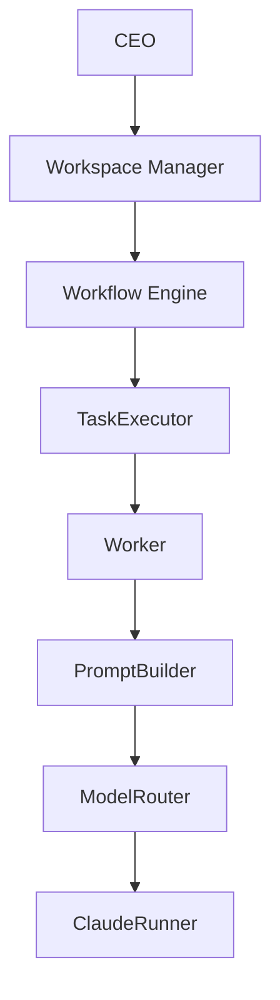

# Architecture

## 概要

Workspace OSは、Obsidian Vault上のMarkdownを人間とAIが共有できる永続データとして扱います。実行ロジックはPython側へ分離し、組織、プロジェクト、実行、レビュー、Identityを独立したコンポーネントとして構成しています。



Mermaidソース: [architecture.mmd](architecture.mmd)

## Architecture Decision Records

重要な設計判断は[docs/adr](adr/)で管理します。

- [ADR-0001: GoをWorkspace OSの中核実装とする](adr/ADR-0001-go-core.md)
- [ADR-0002: PythonとGo CoreをJSON Contractで疎結合にする](adr/ADR-0002-json-contract.md)
- [ADR-0003: Workspace Kernelを中心コンポーネントとする](adr/ADR-0003-workspace-kernel.md)
- [ADR-0004: Event DrivenをWorkspace OSの基本設計とする](adr/ADR-0004-event-system.md)
- [ADR-0005: Task lifecycleをGo TaskServiceの責務とする](adr/ADR-0005-task-lifecycle.md)
- [ADRテンプレート](adr/ADR-template.md)

## コンポーネント

| コンポーネント | 責務 |
|---|---|
| Workspace Manager | CEOの依頼から提案と必要なAI社員を構成する |
| Organization | 社員Markdown、Workspace Manager、予約Identityを読み取る |
| Recruiter | 社員IDと氏名を検証してAI社員を採用する |
| IdentityPolicy | 全組織のID、氏名、姓、名、類似度を診断する |
| ProjectManager | プロジェクトと社員IDベースのタスクを管理する |
| WorkflowEngine | 1タスクの実行、レビュー、修正分岐を調整する |
| TaskExecutor | タスクを検証し、Worker実行と成果物保存を管理する |
| Worker | 社員IDに対応するAI社員の実行コンテキストを保持する |
| PromptBuilder | 会社、社員、日時、プロジェクト、タスク情報をプロンプトへ統合する |
| ModelRouter | 社員Markdownの`model`値を登録済みRunnerへ解決する |
| ClaudeRunner | Anthropic SDKを呼び出し、Markdownと実行統計を返す |
| ReviewerWorker | 元担当者とは別のAI社員として成果物をレビューする |
| RevisionTaskService | Request Changesから元担当社員向け修正タスクを作る |
| EmployeeRenameService | IDを維持して構造化された氏名参照だけを安全に改名する |
| Workspace Kernel | Goサービスの登録・参照、ライフサイクル、Command実行を調停する |
| Go Event Service | 型付きBusiness Eventを検証し、in-process Busで同期配信する |
| Go Task Service | Task lifecycle、Version/CAS、Store境界、Event発行を管理する |
| Go Workflow Core | タスク依存関係の解析、検証、実行可否判定を純粋なドメインロジックとして提供する |
| Go Project Core | TASK-ID採番、Task検証、状態と遷移規則を純粋なドメインロジックとして提供する |

## データ境界

### Obsidian Vault

- `社員/*.md`: AI社員のID、部署、役割、モデル、状態
- `会社/Workspace State.md`: Workspace Manager、社員一覧、部署一覧、会社状態
- `会社/Identity History.md`: 改名監査履歴
- `プロジェクト/<name>/Project.md`: プロジェクト概要
- `Tasks.md`: タスクID、状態、担当社員ID
- `Deliverables/`: AI社員が作成した成果物
- `Reviews/`: 人間向けレビューと検証済みJSON
- `Revisions/`: レビューから作られた修正タスクのメタデータ
- `Progress.md`と`Audit Log.md`: 実行・レビュー履歴

### Python

Python層はMarkdownとObsidianのI/O、Adapter、Prompt、Runner、LLM SDKを担当します。新しいビジネスルールの正本はGo Coreへ寄せ、Python側にはI/Oとオーケストレーションの責務を残します。

### Go Coreへの段階移行

Workspace OSは、中核ロジックをPythonからGo Coreへ段階的に移行しています。移行期間中もPython実装を本番実装・比較対象として維持し、共有fixtureでGoとの同等性を確認します。

- 依存解析や実行可否判定など、副作用のないCoreから順次Goへ置き換えます。
- MarkdownやObsidianのファイルI/OはCoreの外側に置きます。
- AI Runner、PromptBuilder、ModelRouterなどのAI連携層は当面Pythonに残します。
- Go CoreはCrewAI、外部LLM SDK、Pythonランタイム、`.env`へ依存しません。
- Rustへの主移行は行わず、GoをWorkspace OSの中核実装として育てます。

現在のGo Coreは次のパッケージで構成します。

- `go/internal/workflow`: 依存解析、循環検出、実行可否判定
- `go/internal/project`: ProjectService向け後方互換Facade。Task規則はTask Domainへ委譲
- `go/internal/event`: 型付きEvent、検証、UUIDv4 ID、in-memory Event Bus
- `go/internal/task`: Task状態、遷移、失敗事実、Versionを管理するDomain
- `go/internal/taskstore`: TaskStoreのin-memory Adapter
- `go/internal/service`: Kernel向けProject/Workflow/Task/Event Facade
- `go/internal/kernel`: サービス境界、ライフサイクル、Command調停
- `go/internal/bootstrap`: 具体Serviceを登録するcomposition root
- `go/cmd/workspace-core`: バージョン付きJSON契約を公開するCLI境界

PythonとGoは`fixtures/workflow`、`fixtures/project`、`fixtures/go_core`のJSONを共通契約として使用します。実行時の境界は次のとおりです。

```text
Python Adapter (GoCoreClient / ProjectManager / ProjectWorkflowService)
    ↓ JSON Contract v1 (stdin/stdout)
workspace-core CLI
    ↓
Workspace Kernel
    ├── ProjectService
    │       ↓
    │   Project Domain
    ├── WorkflowService
    │       ↓
    │   Workflow Domain
    ├── TaskService
    │       ├── Task Domain
    │       ├── TaskStore
    │       └── EventService
    └── EventService
            ↓
        Event Bus
```

Go CoreはProject/Workflow領域のビジネスルールの正本です。`ProjectManager`はObsidian Markdown Adapterへ段階的に縮小しており、`GoCoreClient`を通じてTASK-ID採番、Task検証、状態遷移判定をGoへ委譲します。`ProjectWorkflowService`もTasks、依存メタデータ、社員存在情報を標準化して`workflow.readiness`へ渡し、Python側ではreadinessを再判定しません。

Go Coreが利用できない場合のPythonフォールバックは明示設定時だけ許可されます。利用実装は`task_id_source`、`task_validation_source`、`status_transition_source`、`workflow_readiness_source`で追跡できます。legacy Python実装は移行期間中のreference/explicit fallbackに限定します。`workspace-core`はファイルシステムや`.env`を読み書きせず、標準出力にはJSONだけを返します。

JSON契約v1は、`version`、`operation`、`payload`を標準入力で受け取り、`version`、`ok`、`result`、`error`を標準出力へ1件だけ返します。エラーは内部例外文を公開せず、次の機械判定可能なコードを使用します。

| 分類 | エラーコード |
|---|---|
| 契約 | `INVALID_REQUEST`, `UNSUPPORTED_VERSION`, `UNKNOWN_OPERATION`, `INTERNAL_ERROR` |
| Project | `INVALID_TASK_ID`, `DUPLICATE_TASK_ID`, `INVALID_STATUS`, `INVALID_TRANSITION`, `INVALID_TASK_TITLE`, `INVALID_ASSIGNEE_ID` |
| Workflow | `UNKNOWN_DEPENDENCY`, `CYCLIC_DEPENDENCY` |

対応operationは`project.next_task_id`、`project.validate_task`、`project.can_transition`、`workflow.readiness`です。ローカルバイナリは`make go-build`で`bin/workspace-core`へ生成し、`bin/`はGit管理しません。

PromptBuilder、Worker、ModelRouter、LLM Runner、外部LLM SDKは当面Pythonに残します。Task lifecycleはGo TaskServiceへ移行済みです。次の段階ではWorkflowEngineのオーケストレーションとWorker／Runner境界をGoへ移し、PythonはVault I/OとAI Adapterへさらに縮小します。

### Workspace Kernel v0.3

`go/internal/kernel`はWorkspace OSの中心となる最小Kernelです。サービスの登録・参照、`started`/`stopped`ライフサイクル、状態snapshot、構造化Commandの受付だけを担当します。Project、Workflow、Task、Organizationのビジネスルールは各Domainへ委譲し、Kernel自身には持ち込みません。

```text
workspace-core CLI (JSON Contract v1)
    ↓ Command
Workspace Kernel
    ├── ProjectService
    │       ↓
    │   Project Domain
    ├── WorkflowService
    │       ↓
    │   Workflow Domain
    ├── TaskService
    │       ├── Task Domain
    │       ├── TaskStore
    │       └── EventService
    └── EventService
            ↓
        Event Bus

将来追加
    ├── Organization Service
    ├── Scheduler
    ├── Audit
    └── Worker
```

`bootstrap.NewDefaultKernel`がProjectService、WorkflowService、TaskService、EventServiceの具体実装を登録します。Kernel StartはEventServiceの後にTaskServiceを有効化し、Kernel StopはTaskServiceを無効化してからEventServiceを停止します。`kernel.status`には4 Serviceが表示されます。既存CLI Commandは従来どおり`CLI → Kernel → Service → Domain`を通り、JSON Contract v1のoperation、payload、result、error codeは変更していません。

EventServiceはKernelのライフサイクルに従います。購読はKernel起動前に構成でき、PublishはStart後のみ受け付け、Stop後は拒否します。Kernelが保持するのはEventService interfaceだけであり、Event Bus内部実装、handler、永続化を知りません。

初期Event配送はin-process、synchronous、at-most-onceです。1回のPublish内はsubscriber登録順、逐次Publishは呼び出し順を維持します。並行Publish間のglobal ordering、自動retry、永続queueは提供しません。subscriber失敗は他のsubscriberを抑止せず、集約して呼び出し元へ返します。Auditは将来`Event Bus → Audit Subscriber → Audit Store`として接続し、Event DomainはAudit MarkdownやObsidianへ依存しません。

TaskServiceはCreate、Start、Complete、Fail、Hold、Resume、Getを提供します。TaskStore更新はVersionによるcompare-and-setを使います。Store成功後のEvent Publish失敗は保存済み状態を含む型付き部分成功エラーとして返し、初期版ではrollbackや自動retryを行いません。将来の永続AdapterではTransactional Outboxを追加できる境界です。

```text
TaskStarted
    ↓
WorkerService (future)
    ↓
RunnerService (future)
    ↓
TaskService.Complete / TaskService.Fail
```

Scheduler、Worker実行、LLM呼び出し、Obsidian I/OはKernelに含めません。Project/Workflow/Task/Eventのビジネスルールの正本は各Domainパッケージであり、Serviceは型付きFacade、Kernelは実行調停、CLIはJSON Adapterに限定します。

## 主要な設計原則

1. **Markdownを正とする**: 人間がObsidianで確認できるデータを永続状態とします。
2. **IDを参照にする**: 社員名は表示情報、社員IDはタスクと監査の永続参照です。
3. **明示的承認**: TaskExecutor、ReviewerWorker、RevisionTaskServiceは実行に承認を要求します。
4. **dry-run優先**: API呼び出しやVault更新前に実行計画を確認できます。
5. **原子的更新**: 一時ファイルと置換を用い、不完全なMarkdownを残しません。
6. **失敗を状態へ残す**: タスク失敗は保留、レビュー失敗はAudit Logへ記録します。
7. **監査証跡を保持する**: 過去の成果物、レビュー、Audit Logを無差別に書き換えません。
8. **依存注入**: Fake Runner、Mockクライアント、将来のRunnerを差し替えられます。

## Runner拡張

ModelRouterはモデル値とRunner名を登録する構造です。v0.1.0では`Claude Sonnet 5`を`ClaudeRunner`へ解決します。未知のモデル値や未登録Runnerは安全に拒否されます。

```python
router.register_runner(
    "ClaudeRunner",
    claude_runner,
    model_values=("Claude Sonnet 5",),
)
```

OpenAI、Gemini、Ollamaなどは、同じ`run()`契約を実装して登録する拡張を想定しています。
