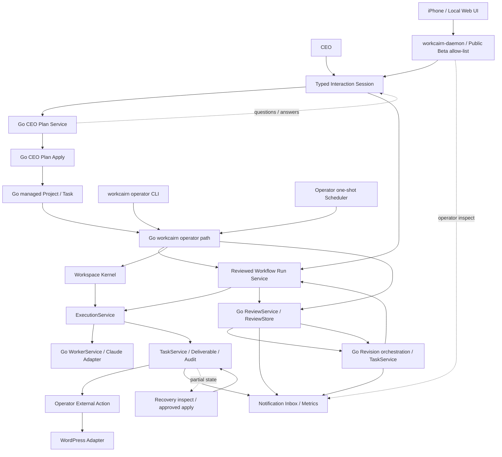

# Architecture

## 概要

WorkCairnは、自分専用のAI会社へ仕事を任せ、必要な質問と重要な承認だけを人間へ返すlocal-first製品です。Obsidian Vault上のMarkdownを人間とAIが共有できる永続データとして扱います。Interaction Session、通常Task execution、Review、Revision、Organization／Identity、Project bootstrap、通常Task作成、CEO plan生成／適用、one-shot Scheduler、Notification／Metrics、External ActionはGoです。repository、build、test、release、distributionもGo Onlyです。

現在のシステムを利用フローから一貫して読む場合は[System Overview](SystemOverview.md)を参照してください。この文書はpackage、port、compositionの詳細を補足します。



Mermaidソース: [architecture.mmd](architecture.mmd)

## Architecture Decision Records

重要な設計判断は[docs/adr](adr/)で管理します。

- [ADR-0001: GoをWorkspace OSの中核実装とする（当時の名称）](adr/ADR-0001-go-core.md)
- [ADR-0002: PythonとGo CoreをJSON Contractで疎結合にする](adr/ADR-0002-json-contract.md)
- [ADR-0003: Workspace Kernelを中心コンポーネントとする](adr/ADR-0003-workspace-kernel.md)
- [ADR-0004: Event DrivenをWorkspace OSの基本設計とする（当時の名称）](adr/ADR-0004-event-system.md)
- [ADR-0005: Task lifecycleをGo TaskServiceの責務とする](adr/ADR-0005-task-lifecycle.md)
- [ADR-0006: WorkerとRunnerをProvider非依存の境界で分離する](adr/ADR-0006-worker-runner-boundary.md)
- [ADR-0007: Workflow executionとPolicyをTask lifecycleから分離する](adr/ADR-0007-workflow-execution-policy.md)
- [ADR-0008: Tasks.mdの5列表とmanaged metadataを同一ファイルで永続化する](adr/ADR-0008-vault-taskstore-metadata.md)
- [ADR-0009: DeliverableをTask完了より先にcommitする](adr/ADR-0009-deliverable-commit-ordering.md)
- [ADR-0010: Review JSONをhuman-readable Markdownより先にcommitする](adr/ADR-0010-review-artifact-commit-ordering.md)
- [ADR-0011: Review factをcanonical JSON commit後にEventとして発行する](adr/ADR-0011-review-fact-event-ordering.md)
- [ADR-0012: Revision intentをTask作成より先にcommitする](adr/ADR-0012-revision-intent-commit-ordering.md)
- [ADR-0013: Projectをdirectory単位でbootstrapしTask作成をTaskServiceへ集約する](adr/ADR-0013-project-bootstrap-and-task-creation.md)
- [ADR-0014: Employee MarkdownをWorkspace State projectionより先にcommitする](adr/ADR-0014-employee-hire-commit-ordering.md)
- [ADR-0015: Employee rename intentを先行保存しfile renameをIdentity commit pointとする](adr/ADR-0015-employee-rename-intent-and-commit.md)
- [ADR-0016: Employee ID repair intentを先行保存しEmployee Markdownを順次commitする](adr/ADR-0016-employee-id-repair-commit-ordering.md)
- [ADR-0017: Employee rename batchは全件preflight後に単一rename commitを順次調停する](adr/ADR-0017-employee-rename-batch-composition.md)
- [ADR-0018: CEO plan applyはProject、Task、Dependency projectionを順次commitする](adr/ADR-0018-ceo-plan-apply-commit-ordering.md)
- [ADR-0019: CEO plan生成と適用をGo typed contractで分離する](adr/ADR-0019-ceo-plan-generation-and-cutover.md)
- [ADR-0020: 確定証拠に拘束された診断と明示Recoveryを先行する](adr/ADR-0020-explicit-recovery-foundation.md)
- [ADR-0021: Command claimを副作用より先にcommitし同一IDの再送を判定する](adr/ADR-0021-command-ledger-claim-before-effects.md)
- [ADR-0022: version付き同期Command APIをGo daemonの最初の外部入口とする](adr/ADR-0022-versioned-http-command-api-and-daemon.md)
- [ADR-0023: Multi-task Workflowは再planする順次Task commandとして構成する](adr/ADR-0023-sequential-workflow-command-composition.md)
- [ADR-0024: Reviewed Workflowは既存Task、Review、Revision commandを決定的に構成する](adr/ADR-0024-reviewed-workflow-branch-composition.md)
- [ADR-0025: Schedulerは承認済みone-shot CommandをLedger経路へ配送する](adr/ADR-0025-one-shot-scheduler-command-dispatch.md)
- [ADR-0026: NotificationとMetricsをredacted Event subscriberとして接続する](adr/ADR-0026-redacted-notification-and-metrics-subscribers.md)
- [ADR-0027: External Actionはimmutable request evidenceを先行commitして公開する](adr/ADR-0027-external-action-evidence-and-publication.md)
- [ADR-0028: Interaction Sessionは質問回答と承認対象digestをappend-only turnで保持する](adr/ADR-0028-interaction-session-clarification-and-approval.md)
- [ADR-0029: Interactionは既存Reviewed Workflowを決定的child Commandとして実行する](adr/ADR-0029-interaction-reviewed-workflow-composition.md)
- [ADR-0030: Interactionは明示Deliverableを既存External Actionへ引き渡す](adr/ADR-0030-interaction-external-action-handoff.md)
- [ADR-0031: iPhone向けLocal Web UIはdaemon同一originと明示LAN pairingで提供する](adr/ADR-0031-mobile-local-web-interaction-client.md)
- [ADR-0032: mobile Interaction Commandをclient接続から切り離して追跡する](adr/ADR-0032-mobile-command-continuity.md)
- [ADR-0033: Public Beta前にrepositoryとdistributionをGo Onlyへ確定する](adr/ADR-0033-public-beta-go-only-repository.md)
- [ADR-0034: WorkCairnを製品名としLiving Company Dashboardをread-only projectionとして提供する](adr/ADR-0034-workcairn-brand-and-living-company-dashboard.md)
- [ADR-0035: Autonomy Contractを承認範囲に固定しProof of Workをcanonical evidenceから投影する](adr/ADR-0035-autonomy-contract-and-proof-of-work.md)
- [ADR-0036: Provider接続状態とRuntime routingを分離する](adr/ADR-0036-provider-connection-and-runtime-routing.md)
- [ADR-0037: First-run setupを明示CommandとしPublic Beta UIをread-only projectionに保つ](adr/ADR-0037-public-beta-setup-and-ui-projection.md)
- [ADR-0038: macOS First-runをLocal OS Adapterへ閉じ込める](adr/ADR-0038-macos-first-run-and-local-os-integration.md)
- [ADR-0039: CEO PlanをLLM Intent + Go Normalizerで構築する](adr/ADR-0039-ceo-plan-intent-normalization.md)
- [ADR-0040: Reviewer RequirementをGo単一箇所で解決しReviewをTyped Decisionへ移行する](adr/ADR-0040-reviewer-requirement-and-typed-review-decision.md)
- [ADR-0041: Typed FailureEnvelopeをchild→outer→Ledger→HTTP→UIへそのまま伝播する](adr/ADR-0041-typed-failure-envelope-propagation.md)
- [ADR-0042: Public Betaの一般daemonをInteraction Reviewed Workflow経路へ限定する](adr/ADR-0042-public-beta-product-path.md)
- [ADR-0043: actual daemonとChromium／WebKitによるPublic Beta Browser Acceptance Gate](adr/ADR-0043-public-beta-browser-acceptance-gate.md)
- [ADR-0044: macOS Keychain永続化をnative helperへ移す](adr/ADR-0044-native-macos-keychain-persistence.md)
- [ADR-0045: bounded Provider request timeoutをRuntime compositionで一本化する](adr/ADR-0045-bounded-provider-request-timeout-policy.md)
- [ADR-0046: CEO Intent Contractを最小化する](adr/ADR-0046-ceo-intent-contract-minimization.md)
- [ADR-0047: Read-only Conversation Projection — Typed Facts, No Fabricated Speaker](adr/ADR-0047-read-only-conversation-projection.md)
- [ADR-0048: Organization-scoped Required Role Enum — Short-term Bridge toward Capability-based Assignment](adr/ADR-0048-organization-scoped-required-role-enum.md)
- [ADR-0049: Go-owned Durable Chained Approval for Plan Apply and Reviewed Workflow Execution](adr/ADR-0049-go-owned-durable-chained-approval.md)
- [ADR-0050: Interaction Archive Semantics — Visibility Metadata via Append-only Turn History, Not Physical Delete](adr/ADR-0050-interaction-archive-semantics.md)
- [ADR-0051: Leverage Engine — Parallel Reviewed Workflow and Decomposition Bounds Foundation](adr/ADR-0051-leverage-engine-parallel-decomposition-foundation.md)
- [ADR-0052: Revision Limit Recovery and the No-Progress Foundation](adr/ADR-0052-revision-limit-recovery-and-no-progress-foundation.md)
- [ADR-0053: Progress Intelligence v1 — Deliverable Change, Structured Review, and Resource Signals](adr/ADR-0053-progress-intelligence-v1.md)
- [ADR-0054: BudgetGuard v1 — Runtime / Provider Call / Token Accounting Foundation](adr/ADR-0054-budgetguard-v1.md)
- [ADR-0055: Budget Recovery Continuation — Resume Created Revision Safely](adr/ADR-0055-budget-recovery-continuation.md)
- [ADR-0056: Dependency Evidence Context for Synthesis](adr/ADR-0056-dependency-evidence-context.md)
- [ADR-0057: Synthesis Quality Acceptance — Deterministic-First Provider Evaluation](adr/ADR-0057-synthesis-quality-acceptance.md)
- [ADR-0058: Provider Output Completeness Policy — Truncated Output Is Never Silent Success](adr/ADR-0058-provider-output-completeness-policy.md)
- [ADRテンプレート](adr/ADR-template.md)

## コンポーネント

### Public Beta exposure boundary

一般利用者の正式経路は`First Run → Interaction → CEO Intent → Go Canonical Plan → Plan Approval → Project／Task commit → Reviewed Workflow Approval → Task／Deliverable → Typed Review → Revision／再Review → Completion → Timeline／Proof of Work`です。`workcairn-daemon`の`POST /v1/commands`はADR-0042により`workspace.setup`と5つの`interaction.*` operationだけをexact allow-listし、それ以外をExecutor前にdefault denyします。

direct Task／Review／Revision、plain／direct Reviewed Workflow、CEO apply、Project／Task／Organization writer、Scheduler、External Actionは既存CLI／内部Process／Recovery用に維持しますが、一般daemonのside-effect surfaceとLocal Web UIからは到達不能です。JSON Contract v1、Command Ledger、Vault canonical evidenceは変更しません。

### Browser acceptance boundary

`tests/browser`は製品Runtimeの外にあるtest-only harnessです。Playwrightがactual `workcairn-daemon` subprocess、embedded UI、temporary Vault、`fixtures/provider/browser_acceptance_v1.json`の固定Anthropic互換responseをChromium／WebKitから操作します。NodeはGo module、Kernel／Domain／Service／Adapter、release binary／archiveへ入らず、`make public-beta-browser-gate`もGo品質を判定する`make v1-release-gate`から分離します。

Browser Gateはpolling、DOM、pairing、reload、daemon restartを検証しますが、実Safari／iPhone、private-LAN source address、実Providerはhuman acceptanceとして残します。詳細は[PublicBetaBrowserAcceptance.md](PublicBetaBrowserAcceptance.md)を参照してください。

| コンポーネント | 責務 |
|---|---|
| Workspace Manager | CEO依頼と承認を担う外部actor。Go CEO Plan入口を利用する |
| Go Organization／Identity | 社員Markdown、Workspace Manager、予約Identityを構造化inventoryへ読み、構造・氏名policyを検査する |
| Go Identity Policy | 全組織のID、氏名、姓、名、類似度を診断するProvider／Vault-neutral Domain |
| Workspace Kernel | Goサービスの登録・参照、ライフサイクル、Command実行を調停する |
| Go Event Service | 型付きBusiness Eventを検証し、in-process Busで同期配信する |
| Go Task Service | Task lifecycle、Version/CAS、Store境界、Event発行を管理する |
| Go Worker Service | AI社員の実行ContextからPromptを構築し、登録済みRunnerを選択して構造化結果を返す |
| Go PromptBuilder | 構造化された会社・社員・日時・Project・Task Contextから通常Task用Promptを決定的に構築する。ADR-0056により、直接依存Taskのcanonical Deliverableをprovenance付きの信頼されないUser Contextとして順序どおり追加し、UTF-8安全な固定上限で決定的に切り詰める。依存が2件以上（Synthesis相当のfan-in）の場合だけ、複数の参照情報を関連付けて1つの結論・具体的なaction／根拠／効果／検証方法へ落とし込む方針をSystemへ追加する（ADR-0057 Addendum、scenario固有keywordは含まない）。依存なし・依存1件のPromptは既存goldenとbyte-for-byte互換 |
| Go Review PromptBuilder／ReviewService | 構造化Review Contextからversioned Promptを構築し、Runner結果のmarked JSONをallow-list検証する。Task変更は行わない |
| Go CEO Plan Domain／Service | 構造化Employee inventoryから小さいIntent向けPromptを作り、RunnerのIntent JSON出力（ADR-0039）をGo Normalizerで解決・正規化してtyped Canonical Planへ変換・検証する。Employee assignment、dependency、識別子はGoが決定し、LLMは意味理解だけを担う。ADR-0051により`steps[].parallel_with_previous`（LLMが供給する唯一のfan-out/fan-in signal）から、依存グラフ形状（1層fan-out＋1層fan-in）もGoが構造的に構築する。`MaxGeneratedTasks`（既定5）がPlan生成側のLoopGuardとしてTask数超過を型付き拒否する。Vault I/O、Provider設定、適用を知らない |
| Go Vault Review Store | ADR-0010に従いcanonical JSONを先行commitし、Markdown projectionとpartial failureを保存する |
| Go Review Orchestration Service | Review実行、artifact保存、`review.completed`発行の順序を調停し、Task状態やAudit形式を知らない |
| Go Revision Orchestration Service | immutable intent、TaskService.Create、`revision.created`の順序とpartial failureを調停する |
| Go Vault Revision Intent Store | ADR-0012のimmutable intentを原子的に作成し、canonical Review参照と既存metadata重複検知を保持する |
| Go Runner Registry | 社員model値をProvider非依存のRunner Adapterへ明示的に解決する |
| Go Claude Runner Adapter | Provider設定を注入され、Anthropic Messages APIとProvider非依存Runner契約を相互変換する |
| Provider Connection Status | Runtime edgeへ注入済み設定をnetwork accessなしでredacted inspectionし、credential／modelの値を公開しない |
| Provider Failure Diagnostics | Claude Adapterが実HTTP status／公式error typeを安全な分類へ変換し、raw messageを破棄してrequest IDとredacted分類だけをInteraction／Ledgerへ渡す |
| Go Runtime | PromptBuilder、Runner Registry、Claude Adapter、TaskStore、DeliverableStore、read-only Dependency Evidence Collector、Audit Handlerをcompositionし、明示承認付きExecution入口を提供する |
| Go Vault Context Adapter | 現行Vault Markdownを読み取り、Employee、Project、Task、dependencyの構造化Execution Contextへ変換する |
| Go Vault TaskStore Adapter | 5列Tasks.mdとmanaged metadataを単一ファイルで原子的に置換し、永続Version/CASとfailure／hold reasonを提供する |
| Go Vault Project Store | 4 managed fileをstagingで完成後、Project directoryを一度だけ公開する |
| Go Vault Employee Store | Identity検証後にEmployee Markdownを先行commitし、Workspace Stateをprojectionする |
| Go Vault Deliverable Adapter | 構造化WorkerResultを安定したimmutable Deliverableへ変換し、既存成果物を上書きせず原子的に作成する |
| Go Vault Audit Subscriber | Task lifecycle Event全体をEvent Handlerとして受け、既存Audit本文を保持したまま原子的に追記する |
| Go Execution Service | readiness、承認、Task lifecycle、Worker実行、失敗Policyを1タスク単位で調停する。ADR-0058により、Provider呼び出し自体は成功したがoutputがProvider自身のtoken ceilingで打ち切られた場合（`worker.StopReasonMaxTokens`）、Deliverable保存やTask completeへ進まず、既存のFail→Hold失敗経路（`ErrorOutputIncomplete`）へ分岐する——Provider呼び出しの成否とDeliverableの完全性は別の問いとして扱う |
| Go Recovery Domain／Service | storage-neutralなSnapshot、finding、version付きplanと、期待Version付きTask recoveryを提供する。推測replayやartifact修復はしない |
| Go Vault Recovery Snapshot Adapter | managed Task、artifact、Audit、既知temporary stateをread-only typed evidenceへ変換する |
| Go Command Ledger Domain／Service | Command ID、request digest、running／terminal outcomeと一度だけのVersion遷移を管理する |
| Go Vault Command Ledger Adapter | Project scopeまたはworkspace scopeのhidden machine metadataへclaimをatomic createし、terminal outcomeをCAS／atomic replacementで保存する |
| Go Process／workcairn | Vault AdapterとRuntimeをprocess edgeでcompositionし、Task metadata migration、read-only execution／recovery plan、明示承認付きexecute／recoveryを提供する |
| Go HTTP API／workcairn-daemon | `workspace-command.v1`、必須Command ID、read-only Ledger／Organization／Task evidence inspection、graceful shutdownを提供し、workcairnと同じprocess／Serviceを利用する。既定はloopback、明示mobile modeだけprivate／link-local IPとprocess-local pairingを許可する。mobile Interaction commandだけadditiveなbounded acceptanceでclient接続から切り離せる |
| Living Company Dashboard | daemon同一originからembed配信する薄いclient。iPhone既定のMy ActionsはInteraction Next Actionを質問／承認／Recoveryへ投影し、PC／iPad既定のCompany ViewはOrganization／Workflow／Task evidenceから社員、Maker、Reviewer、Revision、handoff、Timelineを表示する。同一Session／Versionのpollingでは操作中DOMを再生成せず、Task／Review／Revision規則を持たない |
| First-run Workspace Setup | macOS native picker／Application Support path reference、Mac-only Keychain Adapter、redacted Workspace Statusと、明示承認・workspace Command Ledger・既存Employee writerを使うStarter Organization bootstrap。選択済み専用rootだけを扱い、path／secretをHTTPへ渡さず、既存Vault変更やCoreへの既定社員追加を行わない |
| Go Workflow Run Service | dependency readinessを各Task後に再planし、決定的child Command IDで既存Task executionを順次調停する。Task状態やEventは変更しない |
| Go Reviewed Workflow Run Service | 唯一のoperation `workflow.reviewed.execute`（`process.ExecuteReviewedWorkflow`）が、内部で常に`RunParallel`（ADR-0051）を駆動する。依存関係を満たした全readyタスクを1ラウンドとしてbounded goroutine poolで同時実行し、束全体が終端に達してから次ラウンドをplanする。ready Taskが1件なら実質逐次と同じ挙動、複数件ならGoが自動的に並列実行し、どちらになるかは依存グラフの形だけから毎ラウンド自動的に決まる――呼び出し元がparallel／sequential／concurrencyを選ぶ経路は存在しない。`MaxParallelTasks`／`MaxRevisionCount`（Revision Guard、branch独立counting）はAutonomy Contractから読む。optionalな`policy.ProgressPolicy`（ADR-0052、未設定ならnilで既存挙動のまま）をRequest Changesの都度呼び、Review Progress／Deliverable Progress／Execution Progressの3信号が揃って停滞している場合だけ`no_progress`としてRevision Guardより早くbranchを止められる（既定は`policy.CompoundProgressPolicy`、ADR-0053）――Policy自体はTask状態を変更しない。optionalな`policy.BudgetPolicy`（ADR-0054、未設定ならnilで既存挙動のまま）と`budgetTracker`（並列安全な予約primitive）が、Provider呼び出し直前ごとにRuntime／Provider Call Budgetを強制する（既定は`policy.FixedBudgetPolicy`）――こちらもPolicy自体はTask状態を変更しない。`ResumeRevision`（ADR-0055）はCEOの新Recovery Commandから、既存canonicalなUnstarted Revision Taskを最初のtargeted roundとして実行し、その後だけ同じ`EvaluateAllReadiness`へ戻す。Synthesis専用resume logicは持たない。既存の逐次`Run`メソッド自体は無変更のまま残置（現在の呼び出し元はテストのみ）。TaskState変更経路は既存TaskServiceだけを通る |
| Go Explicit Revision Recovery / Budget Continuation | 同じCEO-facing operation `interaction.workflow.recover_revision`が、canonical factsに応じて2つの異なる内部semanticsを安全に選ぶ。Revision Limit／No Progress（ADR-0052）はstalled source Taskから既存`revision.execute`で新Revisionを作る。Budget stop（ADR-0055）は既にcommit済みのRevision intentとUnstarted Revision Taskを一意に検証し、`ResumeRevision`でそのTaskだけを続行する。いずれも新Command ID、Ledger claim、Session CAS、明示CEO操作が必須で自動retryはしない。Budget Recoveryは新しいbounded Workflow Budget scope（既定60 calls／30分）を持ち、元Workflow CommandをCorrelationID、新child CommandをCausationIDとして維持する。A/Cの完了済み成果は再実行せず、B成功後は既存readinessだけでSynthesisを解放する |
| Go Dependency Evidence Collector | ADR-0056のread-only Service port／Vault Adapter。target Taskのcanonicalな直接依存だけをdependency metadata順に読み、immutable Revision intent lineageを辿って最新のCompleted Revision Taskを選び、非空のcanonical DeliverableをWorkerへ渡す。欠落・pending・曖昧・不正なEvidenceはTask開始前に`DEPENDENCY_EVIDENCE_MISSING`でdefault denyし、Plan／会話／Task titleへfallbackしない |
| Go Synthesis Quality Acceptance | ADR-0057のtest/acceptance専用read-only evaluator。固定日本語scenarioをtemporary Vaultのcanonical Worker／Execution／TaskService／Deliverable経路へ流し、Evidence Coverage・cross-evidence統合・矛盾調停・優先順位・Actionability・unsupported claimを0–2で決定的に採点する。Promptの本文やcredentialは永続化せず、製品state、Progress Policy、FailureEnvelopeを変更しない。実Providerは別の明示opt-inで1 Synthesis callだけ許可する。安全なreportへ`worker.StopReason`（Provider中立なcompleted／max_tokens／stop_sequence／unknown、Claude Adapterが生のstop_reasonから変換）由来の`stop_reason`／`output_truncated`（max_tokensの場合だけtrue、token数からの推測はしない）を追加し、`ArtifactPath`を明示設定した場合だけcanonical Synthesis Deliverable全文をGit外・実Vault外のファイルへ書き出す（既定では何も書かない）。ADR-0058により、`stop_reason=max_tokens`はExecutionService自体がDeliverable未保存のtyped failure（`OUTPUT_INCOMPLETE_FAILURE`、既存の`PROVIDER_FAILURE`/`QUALITY_FAILURE`とは別区分）として扱うため、この場合Evaluatorは実行されない——StopReason／OutputTruncatedはこの失敗経路でも安全reportから引き続き観測できる |
| Go Progress Intelligence | `go/internal/policy`の`ReviewSignature`／`DeliverableFingerprint`／`CompoundProgressPolicy`（ADR-0053）が、「同じQA指摘が繰り返され」「成果物が実質変化せず」「Revisionを既に消費している」という3つの独立したdeterministic signalが揃ったときだけbranchを止める。`ReviewSignature`は`review.Issue`の既存typed enum（Category／Severity）だけから構築し自由文は読まない（sortしてmap iteration順に依存しない）。`DeliverableFingerprint`はDeliverable本文をcontent-blindに正規化したSHA-256で、Domain・Vault・Auditへ一切永続化・露出しない内部比較値。embedding／semantic AI judgeは使わず、Resource Signal（Provider call数・経過時間）は`ProgressSignal`へ観測用として載るだけでPolicyのdecisionには使わない |
| Go BudgetGuard | `go/internal/policy`の`FixedBudgetPolicy`（ADR-0054）が、「出力が改善しているか」ではなく「許可された資源envelopeを既に超えたか」だけを判断する――Progress Intelligenceとは意図的に独立した責務。scopeは1 Reviewed Workflow execution単位で、`autonomy.Contract.MaxRuntime`（既定30分）／`MaxProviderCalls`（既定60、LoopGuardの構造的counterとは別物）の2軸を独立して強制する。`internal/service`の`budgetTracker`が実際の並列安全な予約primitive（atomic reserve→invoke→record、`policy.BudgetPolicy`とは別の意図的にstatefulな機構）で、process-local・1呼び出しscopeのみの保証。Recovery Continuation（ADR-0055）は新しい明示Command／新しいbounded trackerを使い、古い消費量を消去・継承したと推測しない。root lineage全体のdurable Budgetは将来課題。Token使用量は既存の`worker.TokenUsage`のnilable設計（unknown≠0）をそのまま利用し、v1ではゲーティングに使わない。Cost Budgetは未実装（価格tableが存在しないため） |
| Go Scheduler Service | 承認済みone-shot Commandをoffset付き時刻で選択し、Schedule CAS後に既存Process／Command Ledgerへ配送する。Task状態やProviderは直接扱わない |
| Go Notification／Metrics Subscriber | Runtime edgeから既存Eventへ接続し、payload-free immutable Inboxとbounded process-local counterを提供する。Task状態、Event、Auditを変更しない |
| Go External Action Service／WordPress Adapter | 既存Deliverableをtyped intentへ変換し、明示承認、immutable request／result evidence、外部公開、`action.completed`を調停する。credentialとHTTPはAdapter edgeだけに置く |
| Go Interaction Domain／Service | 自然言語request、CEO質問回答、plan digest承認、適用済みProject、Reviewed Workflow／External Actionのtyped summaryとResult digestをappend-only turn／Version/CASで調停する。Provider、Vault、Task状態を知らない |
| Go Autonomy Contract | Workflow承認で委任するTask実行、必須Review、Revision、別承認のExternal Action、禁止された支出、Employee／model allow-list、実行上限をProvider／Vault非依存のtyped valueへ固定する。Execution PolicyやApprovalを置き換えない |
| Go Work Report | Interaction、Task、Deliverable、canonical Review、Revision intent、Command Ledger、AuditからProof of WorkとCEO Attentionを再構成するread-only projection。新しいStore、状態修復、自動retryを持たない |
| Go Workflow Core | タスク依存関係の解析、検証、実行可否判定を純粋なドメインロジックとして提供する |
| Go Project Core | TASK-ID採番、Task検証、状態と遷移規則を純粋なドメインロジックとして提供する |

## データ境界

### Obsidian Vault

- `社員/*.md`: AI社員のID、部署、役割、モデル、状態
- `会社/Workspace State.md`: Workspace Manager、社員一覧、部署一覧、会社状態
- `会社/Identity History.md`: 改名監査履歴
- `プロジェクト/<name>/Project.md`: プロジェクト概要
- `Tasks.md`: 5列の人間可読Task表示と、Go Task DomainのVersion、failure／hold reason、表digestを持つversion付きmanaged metadata
- `Deliverables/`: AI社員が作成した成果物
- `Reviews/`: 人間向けレビューと検証済みJSON
- `Revisions/`: レビューから作られた修正タスクのメタデータ
- `.workspace-os/schedules/`: one-shot Scheduleのdefinition、due time、Version／CAS、dispatch outcome
- `.workspace-os/notifications/`: Event payloadを含まないimmutable Notification projection
- `プロジェクト/<name>/.workspace-os/actions/`: source digestに拘束されたimmutable external Action request／result evidence
- `Progress.md`と`Audit Log.md`: 実行・レビュー履歴

### Go Only Repository and Runtime

WorkCairnの移行は完了しています。`workcairn`、`workcairn-daemon`、`workcairn-core`が正式surfaceであり、他言語のcompatibility package、fallback、SDK、build metadataはありません。経緯は[MigrationHistory.md](MigrationHistory.md)、自動判定は[GoOnlyReleaseGate.md](GoOnlyReleaseGate.md)を参照してください。

Public BetaではmacOS／arm64をTier 1とし、macOS／amd64、Linux／amd64、Linux／arm64はcross-build後に各native smokeを要求します。WindowsはVault file lockが未対応のためsupportしません。このplatform境界はAdapterの制約であり、Domain／Service契約は変更しません。

ADR-0034により公開名、binary、archive、Go module、WorkCairn固有環境変数はWorkCairnへrenameしました。`Workspace`／`Workspace Kernel`は一般Architecture概念、`workspace-command.v1`、`workspace-interaction.v1`、`.workspace-os`、managed metadata markerは通信／永続化contractとして意図的に維持します。実GitHub repository slugの変更はPublic化前の外部release作業です。

- 依存解析や実行可否判定などの副作用のないCoreを含め、中核ルールはGoを正本とします。
- MarkdownやObsidianのファイルI/OはCoreの外側に置きます。
- 通常Task、Review、Revisionのprocess入口はGoです。RevisionはADR-0012に従ってimmutable intentを先行commitし、TaskService.Create後に`revision.created`を発行します。AuditはEvent subscriberであり、partial failureを隠しません。Go Claude Adapterは`.env`を読まず、APIキーとHTTP clientをRuntimeから受け取り、具体Provider modelはAdapter edgeのversioned supported-model policyで解決します。
- Go Coreは外部LLM SDK、別言語runtime、`.env`へ依存しません。
- Rustへの主移行は行わず、GoをWorkCairnの中核実装として育てます。

現在のGo Coreは次のパッケージで構成します。

- `go/internal/workflow`: 依存解析、循環検出、実行可否判定
- `go/internal/project`: ProjectService向け後方互換Facade。Task規則はTask Domainへ委譲
- `go/internal/organization`: Provider／Vault非依存のOrganization inventory、構造検証、Identity Policy
- `go/internal/ceoplan`: Provider／Vault非依存のCEO plan Prompt、typed contract、正規化、適用前検証
- `go/internal/event`: 型付きEvent、検証、UUIDv4 ID、in-memory Event Bus
- `go/internal/task`: Task状態、遷移、失敗事実、Versionを管理するDomain
- `go/internal/taskstore`: TaskStoreのin-memory Adapter
- `go/internal/worker`: AI社員実行のContext、Prompt、Runner要求・結果のDomain契約
- `go/internal/deliverable`: Storage非依存のimmutable Deliverable契約とStore port
- `go/internal/deliverablestore`: Deliverable record向けStorage Adapter
- `go/internal/prompt`: Provider／Vault非依存の通常Task PromptBuilder
- `go/internal/review`: Provider／Vault非依存のReview Context、Prompt port、構造化Review結果
- `go/internal/revision`: Storage非依存のRevision intent、Store port、部分状態Result
- `go/internal/recovery`: Storage非依存のSnapshot／finding、version付きRecovery plan、typed result
- `go/internal/commandledger`: Storage非依存のCommand identity、request digest、running／terminal outcome、Store port
- `go/internal/failure`: Provider／Domain非依存のtyped FailureEnvelope。最初にfailureを確定できるdurable Process boundaryだけが生成し、outer Command／Command Ledger／HTTP／UIはそれを再分類せず転送する
- `go/internal/commandcontract`: HTTP／Schedulerが共有する副作用commandのstrict typed payload契約
- `go/internal/autonomy`: 承認するWorkflowの自律範囲をcanonicalize／検証するProvider／Storage非依存のtyped contract
- `go/internal/interaction`: request／clarification／plan／Workflow approvalのclosed state、append-only turn、結果summary／digest、CAS contract
- `go/internal/scheduler`: Storage／transport非依存のone-shot Schedule、state、Version／CAS、Dispatcher port
- `go/internal/notification`: Task／Review／Revision／Action EventからのredactedなpayloadなしImmutable projection契約
- `go/internal/metrics`: Event typeごとの件数だけを持つbounded process-local Metrics subscriber
- `go/internal/action`: Provider／Storage非依存の外部publication（WordPress等）typed intent／evidence契約
- `go/internal/runner`: model値とRunner Adapterを解決するthread-safe Registry
- `go/internal/adapter/claude`: Anthropic Messages APIを既存Runner契約へ変換するProvider Adapter
- `go/internal/adapter/localos`: macOS folder picker、Application Support path reference、Finder／browser openと、bounded helperからSecurity.frameworkを直接呼ぶKeychain persistenceをRuntime edgeへ閉じ込めるOS Adapter。credentialはanonymous socketだけを通り、Core、Vault contract、Task／EventはmacOS APIやsecretを知らない
- `go/internal/adapter/vault`: read-only Context／Organization Loader、Project／Task／Deliverable／Review／Revision intent／Schedule／Interaction Store、Audit Event subscriber
- `go/internal/runtime`: Provider／Storage AdapterをServiceへ注入するprocess-neutral execution／Review／Revision composition
- `go/internal/process`: Organization参照、Project／Task作成、通常Task／Review／Revision／reviewed Workflow／Schedule／Interaction Workflow／Recoveryのread-only planと明示承認付きexecute、canonical evidenceからのWork Report projection
- `go/internal/httpapi`: version付きCommand HTTP contract、必須Command ID、同期handler、mobile Interactionのbounded acceptance、Ledger／Task evidence／Work Report inspection、embed mobile Web UI、trusted-LAN pairing、graceful server lifecycle
- `go/internal/policy`: 明示承認とWorker失敗後の回復判断を提供する決定的Policy Domain
- `go/internal/execution`: 1タスク実行のRequest、Result、Stage、型付きpartial failure契約
- `go/internal/service`: Kernel向けProject/Workflow/Task/Event/Worker/Execution／Scheduler Facade
- `go/internal/kernel`: サービス境界、ライフサイクル、Command調停
- `go/internal/bootstrap`: 具体Serviceを登録するcomposition root
- `go/cmd/workcairn-core`: バージョン付きJSON契約を公開するCLI境界
- `go/cmd/workcairn`: Organization参照、Project／Task作成、migration、通常Task／Review／Revision／reviewed Workflow、one-shot Schedule、Interaction、Recoveryを公開するGo運用CLI
- `go/cmd/workcairn-daemon`: 同じprocess／Service compositionをloopback既定HTTPと、明示pairing済みtrusted-LAN mobile UIで公開するGo daemon
- `go/internal/buildinfo`: release時にlinkerから注入するversion／commit／build date。DomainやRuntime設定ではない
- `scripts/package-release.sh`: allow-listされたGo binary、LICENSE、docsをversion付きarchiveとSHA-256 checksumへ構成するdistribution edge

`fixtures/workflow`、`fixtures/project`、`fixtures/go_core`のJSONはGo testsが直接検証するlanguage-neutralな契約資産です。JSON Contract v1は外部process client向けの安定した境界です。

```text
External process client
    ↓ JSON Contract v1 (stdin/stdout)
workcairn-core CLI
    ↓
Workspace Kernel
    ├── ProjectService
    │       ↓
    │   Project Domain
    ├── WorkflowService
    │       ↓
    │   Workflow Domain
    ├── ExecutionService
    │       ├── ApprovalPolicy
    │       ├── ExecutionPolicy
    │       ├── TaskService
    │       └── WorkerService
    ├── TaskService
    │       ├── Task Domain
    │       ├── TaskStore
    │       └── EventService
    ├── WorkerService
    │       ├── PromptBuilder port
    │       └── RunnerRegistry
    │               └── Runner Adapter
    └── EventService
            ↓
        Event Bus
```

Go CoreはProject/Workflow領域のビジネスルールの正本です。`workcairn-core`はファイルシステムや`.env`を読み書きせず、標準出力にはJSONだけを返します。外部clientは同じ規則を再実装せず、このversioned contractを利用できます。

JSON契約v1は、`version`、`operation`、`payload`を標準入力で受け取り、`version`、`ok`、`result`、`error`を標準出力へ1件だけ返します。エラーは内部例外文を公開せず、次の機械判定可能なコードを使用します。

| 分類 | エラーコード |
|---|---|
| 契約 | `INVALID_REQUEST`, `UNSUPPORTED_VERSION`, `UNKNOWN_OPERATION`, `INTERNAL_ERROR` |
| Project | `INVALID_TASK_ID`, `DUPLICATE_TASK_ID`, `INVALID_STATUS`, `INVALID_TRANSITION`, `INVALID_TASK_TITLE`, `INVALID_ASSIGNEE_ID` |
| Workflow | `UNKNOWN_DEPENDENCY`, `CYCLIC_DEPENDENCY` |

対応operationは`project.next_task_id`、`project.validate_task`、`project.can_transition`、`workflow.readiness`です。ローカルバイナリは`make go-build`で`bin/workcairn-core`へ生成し、`bin/`はGit管理しません。

通常Task、Review、Revision、Organization／Identity writer、Project／Task writer、CEO plan生成／適用のprocess入口はGoです。CEO planはADR-0019に従い、明示承認後に構造化Employee inventoryからProvider-neutral Serviceと既存Runnerを通ってtyped planとなり、別の明示承認付きapplyでADR-0018のwriterへ渡ります。LLM出力を直接Vaultへ書かず、Project IDと正式Task IDをProvider出力から分離します。Mock Providerとtemporary Vaultで生成からTask Dependency作成までEnd-to-End検証済みです。ADR-0021により、明示Command ID付き主要副作用command、ADR-0023のSequential Workflow、ADR-0024のReviewed Workflowは副作用前にdurable claimを保存し、同一requestのterminal resultを副作用なしでreplayします。`workcairn-core` JSON Contract v1は変更していません。

### Workspace Kernel

`go/internal/kernel`はWorkCairnの中心となる最小Kernelです。サービスの登録・参照、`started`/`stopped`ライフサイクル、状態snapshot、構造化Commandの受付だけを担当します。Project、Workflow、Policy、Execution、Task、Organizationのビジネスルールは各Domain／Serviceへ委譲し、Kernel自身には持ち込みません。

```text
workcairn-core CLI (JSON Contract v1)
    ↓ Command
Workspace Kernel
    ├── ProjectService
    │       ↓
    │   Project Domain
    ├── WorkflowService
    │       ↓
    │   Workflow Domain
    ├── ExecutionService
    │       ├── ApprovalPolicy
    │       ├── ExecutionPolicy
    │       └── DeliverableStore
    ├── TaskService
    │       ├── Task Domain
    │       ├── TaskStore
    │       └── EventService
    ├── WorkerService
    │       ├── PromptBuilder
    │       └── RunnerRegistry
    │               └── Runner
    └── EventService
            ↓
        Event Bus → Audit Handler

追加可能
    └── Organization Service
```

`bootstrap.NewDefaultKernel`がProjectService、WorkflowService、TaskService、EventService、WorkerService、ExecutionServiceの具体実装を登録します。Kernel StartはEventService、TaskService、WorkerService、ExecutionService、optional SchedulerServiceの順に有効化し、Kernel Stopは逆順に停止します。Default Kernelの`kernel.status`には従来どおり6 Serviceが表示され、daemonは別のKernel lifecycleへSchedulerを登録します。既存CLI Commandは従来どおり`CLI → Kernel → Service → Domain`を通り、JSON Contract v1のoperation、payload、result、error codeは変更していません。

EventServiceはKernelのライフサイクルに従います。購読はKernel起動前に構成でき、PublishはStart後のみ受け付け、Stop後は拒否します。Kernelが保持するのはEventService interfaceだけであり、Event Bus内部実装、handler、永続化を知りません。

初期Event配送はin-process、synchronous、at-most-onceです。1回のPublish内はsubscriber登録順、逐次Publishは呼び出し順を維持します。並行Publish間のglobal ordering、自動retry、永続queueは提供しません。subscriber失敗は他のsubscriberを抑止せず、集約して呼び出し元へ返します。Vault Audit Adapterは`Event Bus → Audit Subscriber → Audit Log.md`として既存`event.Handler`を実装し、RuntimeがKernel起動前にTask lifecycle Eventへ購読します。Event DomainとRuntimeはAudit MarkdownやObsidianを知りません。

TaskServiceはCreate、Start、Complete、Fail、Hold、Resume、Getを提供します。TaskStore更新はVersionによるcompare-and-setを使います。in-memory Adapterに加え、Vault AdapterがVersion、failure／hold reason、表digestをmanaged metadataへ保存し、同一directoryの一時ファイル、file sync、rename、directory syncで`Tasks.md`を原子的に置換します。Store成功後のEvent Publish失敗は保存済み状態を含む型付き部分成功エラーとして返し、rollbackや自動retryを行いません。ADR-0020のRecoveryは期待Version付きTaskService APIと同じCASを使い、承認plan後の変更をstaleとして拒否します。Task更新とEventのatomicityは将来のTransactional Outboxで扱います。

```text
TaskStarted
    ↓
WorkerService
    ↓
Runner Adapter
    ↓
DeliverableStore.Save
    ↓
TaskService.Complete / TaskService.Fail
```

WorkerServiceはTask lifecycleから独立し、Employee/Task/Project Contextを受けて`PromptBuilder → RunnerRegistry → Runner`を実行します。ADR-0056ではExecutionServiceがreadiness／approval後、Task開始前にread-only Collectorから直接依存のcanonical Deliverableを集め、同じWorker Contextへadditiveに渡します。PromptBuilderはprovenanceと本文をUser Contextへ決定的に描画しますが、Runner interfaceは変更しません。Evidence欠落時はTaskService.StartにもProviderにも到達しません。RunnerはMarkdown、Task状態、承認、Retry Policyを知りません。KernelはWorkerService interfaceだけを保持し、Provider SDKやAPIキーを参照しません。`bootstrap.NewKernelWithDependencies`へWorker RuntimeとTaskStoreを渡し、`go/internal/runtime`がGo PromptBuilder、Runner Registry、Claude Adapterをcompositionします。既存`NewKernelWithWorkerRuntime`はin-memory TaskStoreを使う後方互換wrapperです。Default KernelはProvider未設定のため、実AI呼び出しを安全に拒否します。

Synthesis Quality Acceptance（ADR-0057）はこのproduction pathの外側にある測定境界です。固定A/B/CをTaskService／Deliverable Storeでcanonical化し、既存Reviewed WorkflowとBudgetGuardを通してSynthesisを生成した後、canonical Deliverableをread-onlyに採点します。EvaluatorはTask状態やReviewを変更せず、LLM-as-JudgeやProgress Intelligenceを呼びません。`PROVIDER=claude`はdry-runが既定で、`EXECUTE=1`を人間が明示した場合だけ1 external Synthesis callを許可します。

```text
WorkflowService.Readiness
    ↓
ApprovalPolicy
    ↓
TaskService.Start
    ↓
WorkerService.Execute
    ├── PromptBuilder
    └── RunnerRegistry
            ├── ClaudeRunner Adapter
            ├── OpenAIRunner (future)
            ├── GeminiRunner (future)
            └── OllamaRunner (future)
    ↓
DeliverableStore.Save
    ↓
TaskService.Complete / Fail
```

WorkerまたはDeliverable保存の失敗時はTaskService.Failで事実として記録した後、ExecutionPolicyがHoldを決定し、TaskService.Holdを呼びます。Deliverable保存後のComplete失敗は保存済み成果物を削除しないpartial failureです。成功時のEvent順序は`TaskStarted → TaskCompleted`、失敗時は`TaskStarted → TaskFailed → TaskHeld`です。ExecutionService自身はTask Event、Workflow Event、Auditを発行しません。

ADR-0058により、Worker呼び出し自体は成功（`workerErr == nil`）してもoutputがProvider自身のtoken ceilingで打ち切られた場合（`worker.StopReason == StopReasonMaxTokens`）は、Deliverable保存へ進まず同じFail→Hold経路（`execution.ErrorOutputIncomplete`、stage `worker`）を通ります——Provider呼び出しの成功／失敗と、Deliverableとして完全かどうかは別の判断であり、後者だけをExecutionServiceが判定します。RunnerとWorkerServiceはこの判断に関与せず、`worker.StopReason`という既存のProvider中立な事実を報告するだけです。生成された部分的な本文自体は失われず、`execution.Result.WorkerResult.Content`として診断目的に残ります（canonical Deliverableとしては保存されません）。`StopReasonCompleted`／`StopReasonStopSequence`（正当な正常終了）／`StopReasonUnknown`（未報告をtruncatedと推測しない）は既存の成功経路のまま変更ありません。

```text
Worker / Deliverable failure, timeout, cancellation
    ↓
TaskService.Fail
    ↓
ExecutionPolicy
    ↓ hold=true
TaskService.Hold
```

通常のcontextはPolicy、TaskService、WorkerService、Runnerまで伝播します。Worker実行中のtimeout/cancel後に失敗記録を可能にするため、Fail/Holdだけは元contextの値を維持した5秒上限のrecovery contextを使用します。同一Taskの並行実行はTaskServiceのVersion/CASが防止し、ExecutionServiceは独自lockを持ちません。

Provider固有のLLM呼び出し、Schedule永続形式、Obsidian I/OはKernelに含めません。KernelはSchedulerを含むService lifecycleだけを所有します。Project/Workflow/Policy/Execution/Task/Event/Worker/Schedulerのビジネスルールと契約の正本は各Domainパッケージであり、Serviceは型付きFacade、Kernelはライフサイクル調停、CLIはJSON Adapterに限定します。

## 主要な設計原則

1. **Canonical dataとprojectionを分ける**: Task metadata、Review JSON、Revision intent等の構造化factと、人間可読Markdownの役割を明示します。
2. **IDを参照にする**: 社員名は表示情報、社員IDはタスクと監査の永続参照です。
3. **明示的承認**: Go製品Runtimeは、状態変更やProvider呼出し前に明示的承認を要求します。
4. **dry-run優先**: API呼び出しやVault更新前に実行計画を確認できます。
5. **原子的更新**: 一時ファイルと置換を用い、不完全なMarkdownを残しません。
6. **失敗を観測可能にする**: Failという実行事実、HoldというPolicy判断、commit済みpartial stateを区別します。
7. **監査証跡を保持する**: 過去の成果物、レビュー、Audit Logを無差別に書き換えません。
8. **依存注入**: Fake Runner、Mockクライアント、将来のRunnerを差し替えられます。

## Runner拡張

Go製品Runtimeは論理model値を`runner.Registry`でRunner Adapterへ解決し、未知のモデル値や未登録Runnerを安全に拒否します。Claudeの`workcairn-auto`はAdapter edgeのversioned policyが具体Provider modelへ解決し、APIキーとHTTP timeoutはRuntimeからconstructorへ注入します。ADR-0045によりProvider requestはRuntime compositionが作る単一のbounded HTTP clientを共有し、Public Beta defaultは5分、CLI／daemonの明示overrideは維持します。具体model ID、APIキー、HTTP timeoutをKernel、WorkerService、Employee Contextへ持ち込みません。Adapterは自動retry、Task状態変更、成果物保存、Auditを行いません。

OpenAI、Gemini、Ollamaなどは、同じ`run()`契約を実装して登録する拡張を想定しています。
