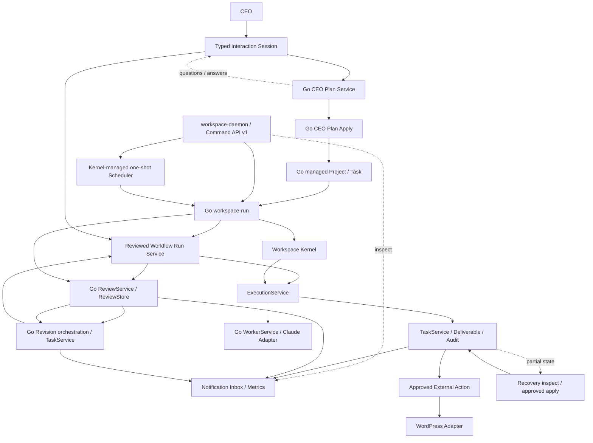

# Architecture

## 概要

Workspace OSは、Obsidian Vault上のMarkdownを人間とAIが共有できる永続データとして扱います。Interaction Session、通常Task execution、Review、Revision、Organization／Identity、Project bootstrap、通常Task作成、CEO plan生成／適用、one-shot Scheduler、Notification／Metrics、External ActionはGoです。PythonはGo process gatewayと公開API referenceに限定していきます。

現在のシステムを利用フローから一貫して読む場合は[System Overview](SystemOverview.md)を参照してください。この文書はpackage、port、compositionの詳細を補足します。



Mermaidソース: [architecture.mmd](architecture.mmd)

## Architecture Decision Records

重要な設計判断は[docs/adr](adr/)で管理します。

- [ADR-0001: GoをWorkspace OSの中核実装とする](adr/ADR-0001-go-core.md)
- [ADR-0002: PythonとGo CoreをJSON Contractで疎結合にする](adr/ADR-0002-json-contract.md)
- [ADR-0003: Workspace Kernelを中心コンポーネントとする](adr/ADR-0003-workspace-kernel.md)
- [ADR-0004: Event DrivenをWorkspace OSの基本設計とする](adr/ADR-0004-event-system.md)
- [ADR-0005: Task lifecycleをGo TaskServiceの責務とする](adr/ADR-0005-task-lifecycle.md)
- [ADR-0006: WorkerとRunnerをProvider非依存の境界で分離する](adr/ADR-0006-worker-runner-boundary.md)
- [ADR-0007: Workflow executionとPolicyをTask lifecycleから分離する](adr/ADR-0007-workflow-execution-policy.md)
- [ADR-0008: Tasks.mdの5列表とmanaged metadataを同一ファイルで永続化する](adr/ADR-0008-vault-taskstore-metadata.md)
- [ADR-0009: DeliverableをTask完了より先にcommitする](adr/ADR-0009-deliverable-commit-ordering.md)
- [ADR-0010: Review JSONをhuman-readable Markdownより先にcommitする](adr/ADR-0010-review-artifact-commit-ordering.md)
- [ADR-0011: Review factをcanonical JSON commit後にEventとして発行する](adr/ADR-0011-review-fact-event-ordering.md)
- [ADR-0012: Revision intentをTask作成より先にcommitする](adr/ADR-0012-revision-intent-commit-ordering.md)
- [ADR-0013: Projectをdirectory単位でbootstrapしTask作成をTaskServiceへ集約する](adr/ADR-0013-project-bootstrap-and-task-creation.md)
- [ADR-0014: Employee MarkdownをWorkspace State projectionより先にcommitする](adr/ADR-0014-employee-hire-commit-ordering.md)
- [ADR-0015: Employee rename intentを先行保存しfile renameをIdentity commit pointとする](adr/ADR-0015-employee-rename-intent-and-commit.md)
- [ADR-0016: Employee ID repair intentを先行保存しEmployee Markdownを順次commitする](adr/ADR-0016-employee-id-repair-commit-ordering.md)
- [ADR-0017: Employee rename batchは全件preflight後に単一rename commitを順次調停する](adr/ADR-0017-employee-rename-batch-composition.md)
- [ADR-0018: CEO plan applyはProject、Task、Dependency projectionを順次commitする](adr/ADR-0018-ceo-plan-apply-commit-ordering.md)
- [ADR-0019: CEO plan生成と適用をGo typed contractで分離する](adr/ADR-0019-ceo-plan-generation-and-cutover.md)
- [ADR-0020: 確定証拠に拘束された診断と明示Recoveryを先行する](adr/ADR-0020-explicit-recovery-foundation.md)
- [ADR-0021: Command claimを副作用より先にcommitし同一IDの再送を判定する](adr/ADR-0021-command-ledger-claim-before-effects.md)
- [ADR-0022: version付き同期Command APIをGo daemonの最初の外部入口とする](adr/ADR-0022-versioned-http-command-api-and-daemon.md)
- [ADR-0023: Multi-task Workflowは再planする順次Task commandとして構成する](adr/ADR-0023-sequential-workflow-command-composition.md)
- [ADR-0024: Reviewed Workflowは既存Task、Review、Revision commandを決定的に構成する](adr/ADR-0024-reviewed-workflow-branch-composition.md)
- [ADR-0025: Schedulerは承認済みone-shot CommandをLedger経路へ配送する](adr/ADR-0025-one-shot-scheduler-command-dispatch.md)
- [ADR-0026: NotificationとMetricsをredacted Event subscriberとして接続する](adr/ADR-0026-redacted-notification-and-metrics-subscribers.md)
- [ADR-0027: External Actionはimmutable request evidenceを先行commitして公開する](adr/ADR-0027-external-action-evidence-and-publication.md)
- [ADR-0028: Interaction Sessionは質問回答と承認対象digestをappend-only turnで保持する](adr/ADR-0028-interaction-session-clarification-and-approval.md)
- [ADR-0029: Interactionは既存Reviewed Workflowを決定的child Commandとして実行する](adr/ADR-0029-interaction-reviewed-workflow-composition.md)
- [ADRテンプレート](adr/ADR-template.md)

## コンポーネント

| コンポーネント | 責務 |
|---|---|
| Workspace Manager | CEO依頼と承認を担う外部actor。Go CEO Plan入口を利用する |
| Python Organization | 公開Python API互換のlegacy writer。通常ID repairでは使用しない |
| Go Organization／Identity | 社員Markdown、Workspace Manager、予約Identityを構造化inventoryへ読み、構造・氏名policyを検査する |
| Recruiter | 公開Python API互換のlegacy。通常Manager callerはGo候補一括検査と単一Employee採用を使用する |
| IdentityPolicy | Go Organization Domainが全組織のID、氏名、姓、名、類似度を診断する。Python版はreference |
| ProjectManager | 公開Python API互換のlegacy facade。製品writerはGo Project／Task process |
| WorkflowEngine | Go通常Task execution、Review、Revisionの各gatewayを1件分調停する公開Python compatibility orchestration |
| WorkspaceRunExecutionGateway | `workspace-run`をshellなしで呼ぶPython process Adapter。Python execution fallbackを持たない |
| TaskExecutor | 公開Python API互換と通常Task reference testだけに残るlegacy実装 |
| Worker／PromptBuilder／ModelRouter／ClaudeRunner | 通常Task／Review製品経路から外れ、公開互換とreference testだけに残るlegacy実装 |
| ReviewerWorker | 公開Python API互換とreference testだけに残るlegacy Review実装 |
| WorkspaceRunReviewGateway | `workspace-run review-*`を呼び、Go Review結果をWorkflowEngineへ返すPython process Adapter |
| WorkspaceRunRevisionGateway | `workspace-run revision-*`を呼び、Go Revision結果をWorkflowEngineへ返すPython process Adapter。legacy fallbackを持たない |
| WorkspaceRunOrganizationGateway | GoのOrganization inventory／Identity検査と、確認済みID repair planをPython互換形へ変換する |
| WorkspaceRunProjectGateway | GoのProject bootstrap／通常Task作成／Task Dependency projectionをPython `ProjectManager`互換形へ変換する |
| WorkspaceRunRecruiterGateway | batch候補全件をGoで検査し、単一Employee採用をGoのcanonical Employee／Workspace State projectionへ渡す。legacy fallbackを持たない |
| WorkspaceRunEmployeeRenameGateway | batch全件をGoでpreflightし、IDを維持する単一Employee renameをGo intent／projectionへ順次渡す。legacyへfallbackしない |
| WorkspaceRunCEOPlanGateway／WorkspaceRunCEOApplyGateway | GoのCEO plan生成／適用を公開Python planner／apply protocolへ変換する。Python Provider／writerへfallbackしない |
| RevisionTaskService | 旧5列Tasks.md向けの公開互換legacy。ADR-0008 managed metadataのwriterには使わない |
| EmployeeRenameService | 公開Python API互換／reference用legacy。通常の単一／batch rename writerには使用しない |
| Workspace Kernel | Goサービスの登録・参照、ライフサイクル、Command実行を調停する |
| Go Event Service | 型付きBusiness Eventを検証し、in-process Busで同期配信する |
| Go Task Service | Task lifecycle、Version/CAS、Store境界、Event発行を管理する |
| Go Worker Service | AI社員の実行ContextからPromptを構築し、登録済みRunnerを選択して構造化結果を返す |
| Go PromptBuilder | 構造化された会社・社員・日時・Project・Task Contextから通常Task用Promptを決定的に構築する |
| Go Review PromptBuilder／ReviewService | 構造化Review ContextからPython互換Promptを構築し、Runner結果のmarked JSONをallow-list検証する。Task変更は行わない |
| Go CEO Plan Domain／Service | 構造化Employee inventoryからcanonical Promptを作り、既存RunnerのJSON出力をtyped planへ正規化・検証する。Vault I/O、Provider設定、適用を知らない |
| Go Vault Review Store | ADR-0010に従いcanonical JSONを先行commitし、Markdown projectionとpartial failureを保存する |
| Go Review Orchestration Service | Review実行、artifact保存、`review.completed`発行の順序を調停し、Task状態やAudit形式を知らない |
| Go Revision Orchestration Service | immutable intent、TaskService.Create、`revision.created`の順序とpartial failureを調停する |
| Go Vault Revision Intent Store | ADR-0012のimmutable intentを原子的に作成し、canonical Review参照とPython legacy重複検知互換を保持する |
| Go Runner Registry | 社員model値をProvider非依存のRunner Adapterへ明示的に解決する |
| Go Claude Runner Adapter | Provider設定を注入され、Anthropic Messages APIとProvider非依存Runner契約を相互変換する |
| Go Runtime | PromptBuilder、Runner Registry、Claude Adapter、TaskStore、DeliverableStore、Audit Handlerをcompositionし、明示承認付きExecution入口を提供する |
| Go Vault Context Adapter | 現行Vault Markdownを読み取り、Employee、Project、Task、dependencyの構造化Execution Contextへ変換する |
| Go Vault TaskStore Adapter | 5列Tasks.mdとmanaged metadataを単一ファイルで原子的に置換し、永続Version/CASとfailure／hold reasonを提供する |
| Go Vault Project Store | 4 managed fileをstagingで完成後、Project directoryを一度だけ公開する |
| Go Vault Employee Store | Identity検証後にEmployee Markdownを先行commitし、Workspace Stateをprojectionする |
| Go Vault Deliverable Adapter | 構造化WorkerResultをPython互換のimmutable Deliverableへ変換し、既存成果物を上書きせず原子的に作成する |
| Go Vault Audit Subscriber | Task lifecycle Event全体をEvent Handlerとして受け、既存Audit本文を保持したまま原子的に追記する |
| Go Execution Service | readiness、承認、Task lifecycle、Worker実行、失敗Policyを1タスク単位で調停する |
| Go Recovery Domain／Service | storage-neutralなSnapshot、finding、version付きplanと、期待Version付きTask recoveryを提供する。推測replayやartifact修復はしない |
| Go Vault Recovery Snapshot Adapter | managed Task、artifact、Audit、既知temporary stateをread-only typed evidenceへ変換する |
| Go Command Ledger Domain／Service | Command ID、request digest、running／terminal outcomeと一度だけのVersion遷移を管理する |
| Go Vault Command Ledger Adapter | Project scopeまたはworkspace scopeのhidden machine metadataへclaimをatomic createし、terminal outcomeをCAS／atomic replacementで保存する |
| Go Process／workspace-run | Vault AdapterとRuntimeをprocess edgeでcompositionし、Task metadata migration、read-only execution／recovery plan、明示承認付きexecute／recoveryを提供する |
| Go HTTP API／workspace-daemon | `workspace-command.v1`、必須Command ID、read-only Ledger inspection、graceful shutdownを提供し、workspace-runと同じprocess／Serviceを利用するloopback入口。認証／TLS導入前は非loopback bindを拒否する |
| Go Workflow Run Service | dependency readinessを各Task後に再planし、決定的child Command IDで既存Task executionを順次調停する。Task状態やEventは変更しない |
| Go Reviewed Workflow Run Service | 各Task後に既存Reviewを実行し、Request Changes時は既存Revisionで作成したTaskをtargeted readinessで実行・再Reviewしてから本流へ戻す |
| Go Scheduler Service | 承認済みone-shot Commandをoffset付き時刻で選択し、Schedule CAS後に既存Process／Command Ledgerへ配送する。Task状態やProviderは直接扱わない |
| Go Notification／Metrics Subscriber | Runtime edgeから既存Eventへ接続し、payload-free immutable Inboxとbounded process-local counterを提供する。Task状態、Event、Auditを変更しない |
| Go External Action Service／WordPress Adapter | 既存Deliverableをtyped intentへ変換し、明示承認、immutable request／result evidence、外部公開、`action.completed`を調停する。credentialとHTTPはAdapter edgeだけに置く |
| Go Interaction Domain／Service | 自然言語request、CEO質問回答、plan digest承認、適用済みProject、Reviewed Workflowのtyped summary／Result digestをappend-only turnとVersion/CASで調停する。Provider、Vault、Task状態を知らない |
| Go Workflow Core | タスク依存関係の解析、検証、実行可否判定を純粋なドメインロジックとして提供する |
| Go Project Core | TASK-ID採番、Task検証、状態と遷移規則を純粋なドメインロジックとして提供する |

## データ境界

### Obsidian Vault

- `社員/*.md`: AI社員のID、部署、役割、モデル、状態
- `会社/Workspace State.md`: Workspace Manager、社員一覧、部署一覧、会社状態
- `会社/Identity History.md`: 改名監査履歴
- `プロジェクト/<name>/Project.md`: プロジェクト概要
- `Tasks.md`: 5列の人間可読Task表示と、Go Task DomainのVersion、failure／hold reason、表digestを持つversion付きmanaged metadata
- `Deliverables/`: AI社員が作成した成果物
- `Reviews/`: 人間向けレビューと検証済みJSON
- `Revisions/`: レビューから作られた修正タスクのメタデータ
- `.workspace-os/schedules/`: one-shot Scheduleのdefinition、due time、Version／CAS、dispatch outcome
- `.workspace-os/notifications/`: Event payloadを含まないimmutable Notification projection
- `プロジェクト/<name>/.workspace-os/actions/`: source digestに拘束されたimmutable external Action request／result evidence
- `Progress.md`と`Audit Log.md`: 実行・レビュー履歴

### Python

Python package全体はv0.1公開compatibility distributionです。既存module path、class、関数、console scriptを維持しますが、製品Runtimeではありません。`workspace_ai.compatibility`がGo process Adapter、凍結legacy implementation、reference module、Provider依存をmachine-readableに分類します。Go process Adapterはlegacy implementationをimportせず、Go failure時にPython Provider／writer／workerへfallbackしません。

CEO plan生成／適用を含む通常の社員候補検査／単一採用／単一・batch rename／ID repair／Workspace State同期、Project bootstrap／Task作成／Task Dependency projection、Task execution、Review、RevisionはGo `workspace-run`が正本です。Go Only Release Gateと現在のPython削除条件は[GoOnlyReleaseGate.md](GoOnlyReleaseGate.md)と[PythonRuntimeInventory.md](PythonRuntimeInventory.md)を参照してください。

### Go Only Runtime

Workspace OSの製品Runtime移行は完了しています。通常Task、Review、RevisionのPython実装は公開互換referenceとして維持し、managed Vaultの製品writerには使用しません。

- 依存解析や実行可否判定などの副作用のないCoreを含め、中核ルールはGoを正本とします。
- MarkdownやObsidianのファイルI/OはCoreの外側に置きます。
- 通常Task、Review、Revisionのprocess入口とPython Workflow caller cutoverはGoへ移行済みです。RevisionはADR-0012に従ってimmutable intentを先行commitし、TaskService.Create後に`revision.created`を発行します。AuditはEvent subscriberであり、partial failureを隠しません。Go Claude Adapterは`.env`を読まず、APIキー、Provider model、HTTP clientをRuntimeから受け取ります。
- Go CoreはCrewAI、外部LLM SDK、Pythonランタイム、`.env`へ依存しません。
- Rustへの主移行は行わず、GoをWorkspace OSの中核実装として育てます。

現在のGo Coreは次のパッケージで構成します。

- `go/internal/workflow`: 依存解析、循環検出、実行可否判定
- `go/internal/project`: ProjectService向け後方互換Facade。Task規則はTask Domainへ委譲
- `go/internal/organization`: Provider／Vault非依存のOrganization inventory、構造検証、Identity Policy
- `go/internal/ceoplan`: Provider／Vault非依存のCEO plan Prompt、typed contract、正規化、適用前検証
- `go/internal/event`: 型付きEvent、検証、UUIDv4 ID、in-memory Event Bus
- `go/internal/task`: Task状態、遷移、失敗事実、Versionを管理するDomain
- `go/internal/taskstore`: TaskStoreのin-memory Adapter
- `go/internal/worker`: AI社員実行のContext、Prompt、Runner要求・結果のDomain契約
- `go/internal/deliverable`: Storage非依存のimmutable Deliverable契約とStore port
- `go/internal/prompt`: Provider／Vault非依存の通常Task PromptBuilder
- `go/internal/review`: Provider／Vault非依存のReview Context、Prompt port、構造化Review結果
- `go/internal/revision`: Storage非依存のRevision intent、Store port、部分状態Result
- `go/internal/recovery`: Storage非依存のSnapshot／finding、version付きRecovery plan、typed result
- `go/internal/commandledger`: Storage非依存のCommand identity、request digest、running／terminal outcome、Store port
- `go/internal/commandcontract`: HTTP／Schedulerが共有する副作用commandのstrict typed payload契約
- `go/internal/interaction`: request／clarification／plan／Workflow approvalのclosed state、append-only turn、結果summary／digest、CAS contract
- `go/internal/scheduler`: Storage／transport非依存のone-shot Schedule、state、Version／CAS、Dispatcher port
- `go/internal/runner`: model値とRunner Adapterを解決するthread-safe Registry
- `go/internal/adapter/claude`: Anthropic Messages APIを既存Runner契約へ変換するProvider Adapter
- `go/internal/adapter/vault`: read-only Context／Organization Loader、Project／Task／Deliverable／Review／Revision intent／Schedule／Interaction Store、Audit Event subscriber
- `go/internal/runtime`: Provider／Storage AdapterをServiceへ注入するprocess-neutral execution／Review／Revision composition
- `go/internal/process`: Organization参照、Project／Task作成、通常Task／Review／Revision／reviewed Workflow／Schedule／Interaction Workflow／Recoveryのread-only planと明示承認付きexecute
- `go/internal/httpapi`: version付きCommand HTTP contract、必須Command ID、同期handler、Ledger inspection、graceful server lifecycle
- `go/internal/policy`: 明示承認とWorker失敗後の回復判断を提供する決定的Policy Domain
- `go/internal/execution`: 1タスク実行のRequest、Result、Stage、型付きpartial failure契約
- `go/internal/service`: Kernel向けProject/Workflow/Task/Event/Worker/Execution／Scheduler Facade
- `go/internal/kernel`: サービス境界、ライフサイクル、Command調停
- `go/internal/bootstrap`: 具体Serviceを登録するcomposition root
- `go/cmd/workspace-core`: バージョン付きJSON契約を公開するCLI境界
- `go/cmd/workspace-run`: Organization参照、Project／Task作成、migration、通常Task／Review／Revision／reviewed Workflow、one-shot Schedule、Interaction、Recoveryを公開するGo運用CLI
- `go/cmd/workspace-daemon`: 同じprocess／Service compositionをloopback HTTPで公開するGo daemon
- `go/internal/buildinfo`: release時にlinkerから注入するversion／commit／build date。DomainやRuntime設定ではない
- `scripts/package-release.sh`: Pythonを含まないGo binary、LICENSE、docsをversion付きarchiveとSHA-256 checksumへ構成するdistribution edge

PythonとGoは`fixtures/workflow`、`fixtures/project`、`fixtures/go_core`のJSONを共有する互換契約を維持します。次は公開Python callerがGo Core互換operationを使う場合のcompatibility境界であり、Go製品Runtimeの内部経路ではありません。

```text
Python Adapter (GoCoreClient / ProjectManager / ProjectWorkflowService)
    ↓ JSON Contract v1 (stdin/stdout)
workspace-core CLI
    ↓
Workspace Kernel
    ├── ProjectService
    │       ↓
    │   Project Domain
    ├── WorkflowService
    │       ↓
    │   Workflow Domain
    ├── ExecutionService
    │       ├── ApprovalPolicy
    │       ├── ExecutionPolicy
    │       ├── TaskService
    │       └── WorkerService
    ├── TaskService
    │       ├── Task Domain
    │       ├── TaskStore
    │       └── EventService
    ├── WorkerService
    │       ├── PromptBuilder port
    │       └── RunnerRegistry
    │               └── Runner Adapter
    └── EventService
            ↓
        Event Bus
```

Go CoreはProject/Workflow領域のビジネスルールの正本です。公開互換の`ProjectManager`と`ProjectWorkflowService`は`GoCoreClient`を通じてTASK-ID採番、Task検証、状態遷移、readinessをGoへ委譲し、Python側では同じルールを新規実装しません。

公開v0.1 Python API内の旧Core互換設定は既存caller互換のため残りますが、製品Runtimeのfallbackではありません。`workspace-run`およびPython Go process AdapterはGo失敗時にlegacy Python Provider、Worker、writerへfallbackしません。`workspace-core`はファイルシステムや`.env`を読み書きせず、標準出力にはJSONだけを返します。

JSON契約v1は、`version`、`operation`、`payload`を標準入力で受け取り、`version`、`ok`、`result`、`error`を標準出力へ1件だけ返します。エラーは内部例外文を公開せず、次の機械判定可能なコードを使用します。

| 分類 | エラーコード |
|---|---|
| 契約 | `INVALID_REQUEST`, `UNSUPPORTED_VERSION`, `UNKNOWN_OPERATION`, `INTERNAL_ERROR` |
| Project | `INVALID_TASK_ID`, `DUPLICATE_TASK_ID`, `INVALID_STATUS`, `INVALID_TRANSITION`, `INVALID_TASK_TITLE`, `INVALID_ASSIGNEE_ID` |
| Workflow | `UNKNOWN_DEPENDENCY`, `CYCLIC_DEPENDENCY` |

対応operationは`project.next_task_id`、`project.validate_task`、`project.can_transition`、`workflow.readiness`です。ローカルバイナリは`make go-build`で`bin/workspace-core`へ生成し、`bin/`はGit管理しません。

通常Task、Review、Revision、Organization／Identity writer、Project／Task writer、CEO plan生成／適用のprocess入口はGoへ移行済みです。CEO planはADR-0019に従い、明示承認後に構造化Employee inventoryからProvider-neutral Serviceと既存Runnerを通ってtyped planとなり、別の明示承認付きapplyでADR-0018のwriterへ渡ります。LLM出力を直接Vaultへ書かず、Project IDと正式Task IDをProvider出力から分離します。mock Providerとtemporary Vaultで生成からTask Dependency作成までEnd-to-End検証済みです。Python gatewayはGo failure時にlegacy Provider／writerへfallbackしません。ADR-0021により、明示Command ID付き主要副作用command、ADR-0023のSequential Workflow、ADR-0024のReviewed Workflowは副作用前にdurable claimを保存し、同一requestのterminal resultを副作用なしでreplayします。既存`workspace-core` JSON Contract v1は変更していません。

### Workspace Kernel

`go/internal/kernel`はWorkspace OSの中心となる最小Kernelです。サービスの登録・参照、`started`/`stopped`ライフサイクル、状態snapshot、構造化Commandの受付だけを担当します。Project、Workflow、Policy、Execution、Task、Organizationのビジネスルールは各Domain／Serviceへ委譲し、Kernel自身には持ち込みません。

```text
workspace-core CLI (JSON Contract v1)
    ↓ Command
Workspace Kernel
    ├── ProjectService
    │       ↓
    │   Project Domain
    ├── WorkflowService
    │       ↓
    │   Workflow Domain
    ├── ExecutionService
    │       ├── ApprovalPolicy
    │       ├── ExecutionPolicy
    │       └── DeliverableStore
    ├── TaskService
    │       ├── Task Domain
    │       ├── TaskStore
    │       └── EventService
    ├── WorkerService
    │       ├── PromptBuilder
    │       └── RunnerRegistry
    │               └── Runner
    └── EventService
            ↓
        Event Bus → Audit Handler

追加可能
    └── Organization Service
```

`bootstrap.NewDefaultKernel`がProjectService、WorkflowService、TaskService、EventService、WorkerService、ExecutionServiceの具体実装を登録します。Kernel StartはEventService、TaskService、WorkerService、ExecutionService、optional SchedulerServiceの順に有効化し、Kernel Stopは逆順に停止します。Default Kernelの`kernel.status`には従来どおり6 Serviceが表示され、daemonは別のKernel lifecycleへSchedulerを登録します。既存CLI Commandは従来どおり`CLI → Kernel → Service → Domain`を通り、JSON Contract v1のoperation、payload、result、error codeは変更していません。

EventServiceはKernelのライフサイクルに従います。購読はKernel起動前に構成でき、PublishはStart後のみ受け付け、Stop後は拒否します。Kernelが保持するのはEventService interfaceだけであり、Event Bus内部実装、handler、永続化を知りません。

初期Event配送はin-process、synchronous、at-most-onceです。1回のPublish内はsubscriber登録順、逐次Publishは呼び出し順を維持します。並行Publish間のglobal ordering、自動retry、永続queueは提供しません。subscriber失敗は他のsubscriberを抑止せず、集約して呼び出し元へ返します。Vault Audit Adapterは`Event Bus → Audit Subscriber → Audit Log.md`として既存`event.Handler`を実装し、RuntimeがKernel起動前にTask lifecycle Eventへ購読します。Event DomainとRuntimeはAudit MarkdownやObsidianを知りません。

TaskServiceはCreate、Start、Complete、Fail、Hold、Resume、Getを提供します。TaskStore更新はVersionによるcompare-and-setを使います。in-memory Adapterに加え、Vault AdapterがVersion、failure／hold reason、表digestをmanaged metadataへ保存し、同一directoryの一時ファイル、file sync、rename、directory syncで`Tasks.md`を原子的に置換します。Store成功後のEvent Publish失敗は保存済み状態を含む型付き部分成功エラーとして返し、rollbackや自動retryを行いません。ADR-0020のRecoveryは期待Version付きTaskService APIと同じCASを使い、承認plan後の変更をstaleとして拒否します。Task更新とEventのatomicityは将来のTransactional Outboxで扱います。

```text
TaskStarted
    ↓
WorkerService
    ↓
Runner Adapter
    ↓
DeliverableStore.Save
    ↓
TaskService.Complete / TaskService.Fail
```

WorkerServiceはTask lifecycleから独立し、Employee/Task/Project Contextを受けて`PromptBuilder → RunnerRegistry → Runner`を実行します。RunnerはMarkdown、Task状態、承認、Retry Policyを知りません。KernelはWorkerService interfaceだけを保持し、Provider SDKやAPIキーを参照しません。`bootstrap.NewKernelWithDependencies`へWorker RuntimeとTaskStoreを渡し、`go/internal/runtime`がGo PromptBuilder、Runner Registry、Claude Adapterをcompositionします。既存`NewKernelWithWorkerRuntime`はin-memory TaskStoreを使う後方互換wrapperです。Default KernelはProvider未設定のため、実AI呼び出しを安全に拒否します。

```text
WorkflowService.Readiness
    ↓
ApprovalPolicy
    ↓
TaskService.Start
    ↓
WorkerService.Execute
    ├── PromptBuilder
    └── RunnerRegistry
            ├── ClaudeRunner Adapter
            ├── OpenAIRunner (future)
            ├── GeminiRunner (future)
            └── OllamaRunner (future)
    ↓
DeliverableStore.Save
    ↓
TaskService.Complete / Fail
```

WorkerまたはDeliverable保存の失敗時はTaskService.Failで事実として記録した後、ExecutionPolicyがHoldを決定し、TaskService.Holdを呼びます。Deliverable保存後のComplete失敗は保存済み成果物を削除しないpartial failureです。成功時のEvent順序は`TaskStarted → TaskCompleted`、失敗時は`TaskStarted → TaskFailed → TaskHeld`です。ExecutionService自身はTask Event、Workflow Event、Auditを発行しません。

```text
Worker / Deliverable failure, timeout, cancellation
    ↓
TaskService.Fail
    ↓
ExecutionPolicy
    ↓ hold=true
TaskService.Hold
```

通常のcontextはPolicy、TaskService、WorkerService、Runnerまで伝播します。Worker実行中のtimeout/cancel後に失敗記録を可能にするため、Fail/Holdだけは元contextの値を維持した5秒上限のrecovery contextを使用します。同一Taskの並行実行はTaskServiceのVersion/CASが防止し、ExecutionServiceは独自lockを持ちません。

Provider固有のLLM呼び出し、Schedule永続形式、Obsidian I/OはKernelに含めません。KernelはSchedulerを含むService lifecycleだけを所有します。Project/Workflow/Policy/Execution/Task/Event/Worker/Schedulerのビジネスルールと契約の正本は各Domainパッケージであり、Serviceは型付きFacade、Kernelはライフサイクル調停、CLIはJSON Adapterに限定します。

## 主要な設計原則

1. **Canonical dataとprojectionを分ける**: Task metadata、Review JSON、Revision intent等の構造化factと、人間可読Markdownの役割を明示します。
2. **IDを参照にする**: 社員名は表示情報、社員IDはタスクと監査の永続参照です。
3. **明示的承認**: Go製品Runtimeは、状態変更やProvider呼出し前に明示的承認を要求します。
4. **dry-run優先**: API呼び出しやVault更新前に実行計画を確認できます。
5. **原子的更新**: 一時ファイルと置換を用い、不完全なMarkdownを残しません。
6. **失敗を観測可能にする**: Failという実行事実、HoldというPolicy判断、commit済みpartial stateを区別します。
7. **監査証跡を保持する**: 過去の成果物、レビュー、Audit Logを無差別に書き換えません。
8. **依存注入**: Fake Runner、Mockクライアント、将来のRunnerを差し替えられます。

## Runner拡張

Python ModelRouterは公開v0.1互換にだけ残ります。Go製品Runtimeは論理model値を`runner.Registry`でRunner Adapterへ解決し、未知のモデル値や未登録Runnerを安全に拒否します。

```python
router.register_runner(
    "ClaudeRunner",
    claude_runner,
    model_values=("Claude Sonnet 5",),
)
```

Go側も同じ論理model値を`runner.Registry`で`ClaudeRunner`へ解決します。Provider model ID、APIキー、HTTP timeoutはClaude AdapterのconstructorへRuntimeから注入し、Kernel、WorkerService、Employee Contextへ持ち込みません。Adapterは自動retry、Task状態変更、成果物保存、Auditを行いません。

OpenAI、Gemini、Ollamaなどは、同じ`run()`契約を実装して登録する拡張を想定しています。
