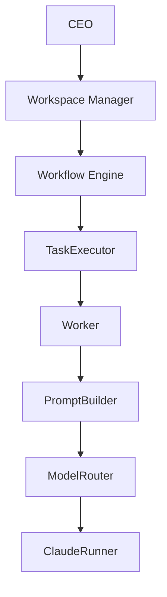

# Architecture

## 概要

Workspace OSは、Obsidian Vault上のMarkdownを人間とAIが共有できる永続データとして扱います。実行ロジックはPython側へ分離し、組織、プロジェクト、実行、レビュー、Identityを独立したコンポーネントとして構成しています。



Mermaidソース: [architecture.mmd](architecture.mmd)

## コンポーネント

| コンポーネント | 責務 |
|---|---|
| Workspace Manager | CEOの依頼から提案と必要なAI社員を構成する |
| Organization | 社員Markdown、Workspace Manager、予約Identityを読み取る |
| Recruiter | 社員IDと氏名を検証してAI社員を採用する |
| IdentityPolicy | 全組織のID、氏名、姓、名、類似度を診断する |
| ProjectManager | プロジェクトと社員IDベースのタスクを管理する |
| WorkflowEngine | 1タスクの実行、レビュー、修正分岐を調整する |
| TaskExecutor | タスクを検証し、Worker実行と成果物保存を管理する |
| Worker | 社員IDに対応するAI社員の実行コンテキストを保持する |
| PromptBuilder | 会社、社員、日時、プロジェクト、タスク情報をプロンプトへ統合する |
| ModelRouter | 社員Markdownの`model`値を登録済みRunnerへ解決する |
| ClaudeRunner | Anthropic SDKを呼び出し、Markdownと実行統計を返す |
| ReviewerWorker | 元担当者とは別のAI社員として成果物をレビューする |
| RevisionTaskService | Request Changesから元担当社員向け修正タスクを作る |
| EmployeeRenameService | IDを維持して構造化された氏名参照だけを安全に改名する |
| Go Workflow Core | タスク依存関係の解析、検証、実行可否判定を純粋なドメインロジックとして提供する |
| Go Project Core | TASK-ID採番、Task検証、状態と遷移規則を純粋なドメインロジックとして提供する |

## データ境界

### Obsidian Vault

- `社員/*.md`: AI社員のID、部署、役割、モデル、状態
- `会社/Workspace State.md`: Workspace Manager、社員一覧、部署一覧、会社状態
- `会社/Identity History.md`: 改名監査履歴
- `プロジェクト/<name>/Project.md`: プロジェクト概要
- `Tasks.md`: タスクID、状態、担当社員ID
- `Deliverables/`: AI社員が作成した成果物
- `Reviews/`: 人間向けレビューと検証済みJSON
- `Revisions/`: レビューから作られた修正タスクのメタデータ
- `Progress.md`と`Audit Log.md`: 実行・レビュー履歴

### Python

Python層はMarkdownの読み取り、検証、状態遷移、Runner呼び出しを担当します。Runner以外のコンポーネントは特定AI APIへ依存しません。

### Go Coreへの段階移行

Workspace OSは、中核ロジックをPythonからGo Coreへ段階的に移行しています。移行期間中もPython実装を本番実装・比較対象として維持し、共有fixtureでGoとの同等性を確認します。

- 依存解析や実行可否判定など、副作用のないCoreから順次Goへ置き換えます。
- MarkdownやObsidianのファイルI/OはCoreの外側に置きます。
- AI Runner、PromptBuilder、ModelRouterなどのAI連携層は当面Pythonに残します。
- Go CoreはCrewAI、外部LLM SDK、Pythonランタイム、`.env`へ依存しません。
- Rustへの主移行は行わず、GoをWorkspace OSの中核実装として育てます。

現在のGo Coreは次のパッケージで構成します。

- `go/internal/workflow`: 依存解析、循環検出、実行可否判定
- `go/internal/project`: TASK-ID、Task Status、状態遷移、Task検証

PythonとGoは`fixtures/workflow`と`fixtures/project`のJSONを共通契約として使用します。Pythonの`ProjectManager`は移行期間中もMarkdown I/Oと既存Adapterとして維持し、Goバイナリとの実行時接続は後続段階で追加します。

## 主要な設計原則

1. **Markdownを正とする**: 人間がObsidianで確認できるデータを永続状態とします。
2. **IDを参照にする**: 社員名は表示情報、社員IDはタスクと監査の永続参照です。
3. **明示的承認**: TaskExecutor、ReviewerWorker、RevisionTaskServiceは実行に承認を要求します。
4. **dry-run優先**: API呼び出しやVault更新前に実行計画を確認できます。
5. **原子的更新**: 一時ファイルと置換を用い、不完全なMarkdownを残しません。
6. **失敗を状態へ残す**: タスク失敗は保留、レビュー失敗はAudit Logへ記録します。
7. **監査証跡を保持する**: 過去の成果物、レビュー、Audit Logを無差別に書き換えません。
8. **依存注入**: Fake Runner、Mockクライアント、将来のRunnerを差し替えられます。

## Runner拡張

ModelRouterはモデル値とRunner名を登録する構造です。v0.1.0では`Claude Sonnet 5`を`ClaudeRunner`へ解決します。未知のモデル値や未登録Runnerは安全に拒否されます。

```python
router.register_runner(
    "ClaudeRunner",
    claude_runner,
    model_values=("Claude Sonnet 5",),
)
```

OpenAI、Gemini、Ollamaなどは、同じ`run()`契約を実装して登録する拡張を想定しています。
