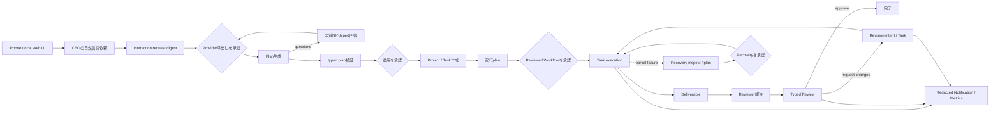
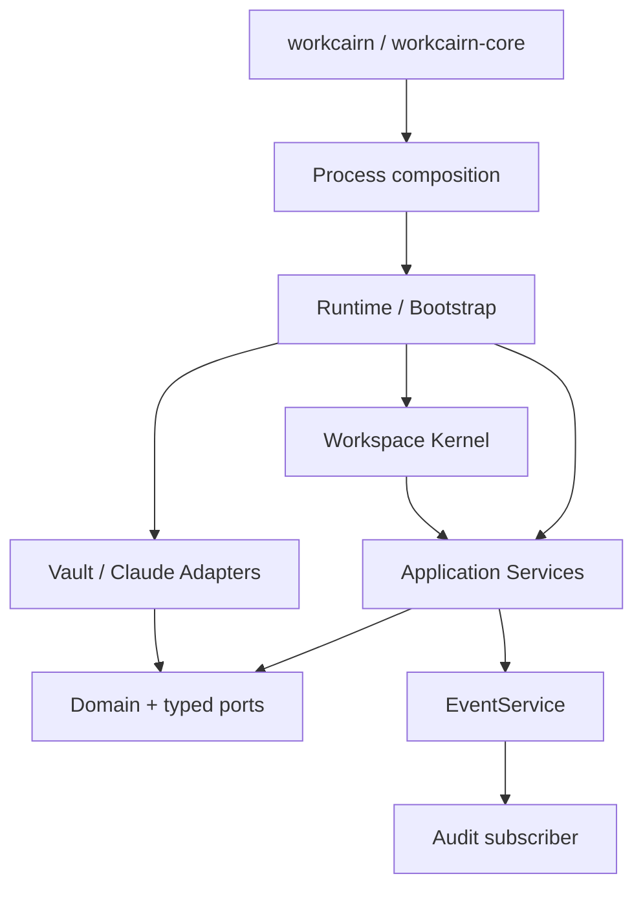

# WorkCairn System Overview

## WorkCairnとは

WorkCairnは「自分専用のAI会社を持つ」local-first製品です。自然言語で仕事を依頼すると、AI社員が計画、実行、独立Review、必要なRevisionを進め、人間にはclarification、approval、Recoveryなど必要な判断だけを返します。会社と仕事の責任は見えますが、細かな管理は要求しません。

Conceptは`Your AI company that manages itself.`、中心思想は「会社は見える。仕事も見える。でも管理しなくていい。」です。現在の製品RuntimeはGo Only、Public Beta候補は`v1.0.0-beta.1`です。正本の運用入口は`workcairn`と`workcairn-daemon`のLocal Web UI、中核のビジネスルールはGo Domain／Service、運用データはVault Adapterが管理します。

Public Betaの一般利用者が通る経路は、ADR-0042により次の1本です。

```text
First Run → Interaction Start → CEO Intent → Go Canonical Plan → Plan Approval
→ Project / Task commit → Reviewed Workflow Approval
→ Task Execution → Deliverable → Typed Review
→ Request ChangesならRevision / Re-review → Completion
→ Timeline / Proof of Work
```

一般daemonは`workspace.setup`とこのInteractionを進める5 operationだけをside-effect allow-listへ持ちます。direct Task／Review／Revision、plain／direct Reviewed Workflow、writer、Scheduler、External Actionはoperator CLI／内部Processとして維持しますが、一般Web UI／daemonから実行できません。

macOSの初回起動では、利用者がnative pickerでWorkCairn専用directoryを明示選択します。iCloud Driveを推奨しますが、既存Vaultを探索・変更しません。選択済みrootはRuntime edgeのApplication Support configから再起動時にcomposeし、Starter Organizationは既存Organization writerを通します。対話利用のClaude credentialはMac native inputからanonymous socketでbounded helperへ渡し、Security.frameworkを直接呼ぶKeychain Adapterで保存・read-backします。ADR-0066の無人運用では、daemon operatorがsourceを明示し、environmentまたはOS user config root配下の固定・0600・現user所有fileだけを読みます。明示source間のfallbackはありません。iPhoneはpath／secretを送らず、redactedなsetup状態とNext Actionだけを表示します。

この文書は「現在どう動くか」を説明します。不変条件は[CONSTITUTION.md](CONSTITUTION.md)、個別判断の理由は[ADR](adr/)、詳細なpackage構造は[Architecture.md](Architecture.md)、安全な導入は[PublicBetaQuickstart.md](PublicBetaQuickstart.md)と[OperatorGuide.md](OperatorGuide.md)、HTTP運用は[HTTPAPI.md](HTTPAPI.md)、今後の順序は[ROADMAP.md](ROADMAP.md)を正とします。

## 外側から見た利用フロー



one-shot Scheduler、Notification／Metrics inspection、WordPress External Actionは実装済みoperator capabilityですが、この一般利用フローには含めません。Public Beta UIはそれらのCommandを発行せず、一般daemonのallow-listも拒否します。

1. CEO依頼は、構造化Employee inventoryとProvider-neutralなPromptからtyped planへ変換します。
2. Provider出力は未知field、未知社員、不正な依存、循環依存をGoで拒否します。生成と適用は分離され、LLM出力を直接Vaultへ書きません。
3. 承認済みplanだけがGo Project／Task writerへ渡り、Project、Task、Task Dependenciesを作成します。承認済みReviewed Workflow commandはdependency readinessをTaskごとに再planし、各TaskをReviewして、Request ChangesならRevision Taskを実行・再Reviewしてから本流へ戻ります。
4. 通常Taskはread-only planで対象、依存、既存成果物を確認した後、別の明示承認で実行します。主要な副作用commandは、Command IDを指定すると副作用前にdurable claimを保存し、同一requestの完了応答を再送しても処理を重複実行しません。
5. Workerは構造化ContextからPromptを作り、Runner RegistryがProvider Adapterを選びます。依存を持つSynthesisでは、ExecutionServiceがTask開始前に直接依存のcanonical Deliverableを収集し、PromptBuilderがprovenance付きの参照専用Contextとして加えます（ADR-0056）。RunnerはTask状態や保存形式を知りません。
6. 成果物を保存してからTaskを完了します。Reviewはcanonical JSON、Markdown表示、Eventの順で成立させます。
7. Reviewが修正を要求した場合は、immutable Revision intentを保存してからTaskServiceで修正Taskを作成します。

Local Web UIはこの順序を再実装しません。`interaction-next`が返す1つの次操作をiPhoneの先頭へ表示し、質問回答とread-only plan、承認対象digestを既存HTTP APIへ渡します。完了後はProject、Task、Deliverable本文、canonical Reviewをread-only evidence endpointから後で展開できます。

## 別デバイスからのLocal Web UI

`workcairn-daemon --local-network`は、同じWi-Fi等のtrusted local network上の別デバイス（iPhone等、任意機能）へLocal Web UIを配信します。起動時にprivate IPv4を自動選択し、terminalへURLとprocess lifetimeだけ有効なpairing codeを表示します。codeはVault、`.env`、Interaction Session、browser storageへ保存されません。

通常の依頼ではModel名を選びません。新規Interactionは論理値`workcairn-auto`を使い、Claude Adapter edgeのversioned supported-model policyが具体modelを自動解決します。製品daemon／CLIはmodel環境変数を読みません。daemonはProviderへ通信せず、ADR-0066の選択済みcredential sourceをredacted statusとして検査し、未接続ならPlan承認の前に設定を案内します。既定`automatic`は既存互換としてenvironment→Keychainの順ですがheadless-localへは進みません。明示`environment`／`keychain`／`headless-local`は他sourceへfallbackしません。Local Web UIの`AI Connections`はClaudeの接続可否とAutomatic routingを表示しますが、credential、Provider model ID、Base URLをUIやSessionへ出しません。credential登録はMac本体のsame-origin操作からnative hidden-inputを開き、値をHTTPへ載せずKeychainへ保存します。trusted LAN上の別デバイスは接続状態だけを読みます。本格的なRole／Task別routingはADR-0036のtyped policyとして既存Runner Registryの手前へ追加し、未接続Providerへの暗黙fallbackは行いません。

Claudeがerror responseを返した場合、Adapterは実HTTP statusと公式error typeだけから認証、請求、権限、request不正、rate limit、一時利用不可を分類します。Provider messageは保存せず、sanitized request IDとredacted分類だけをCommand Ledgerへ残すため、My Actionsは秘密情報を出さず次の確認先を案内できます。分類不能な旧evidenceや未知errorを推測せず、自動retryや別Providerへのfallbackを行いません。

```text
iPhone browser
  → process-local pairing
  → Interaction Session / Next Action
  → read-only plan
  → digestとVersionへの明示承認
  → workspace-command.v1
  → 既存Go Process / Service / Adapter
```

画面には2つのread-only projectionがあります。

- `My Actions`: iPhone既定。次の質問、承認、Recoveryだけを最優先表示する
- `Company View`: PC／iPad既定。AI社員を人型で示し、担当、Maker、Reviewer、Revision、blocked／completedとhandoffを表示する

いずれもInteraction Next Action、Organization inventory、Workflow／Task evidenceを表示するだけで、Task遷移やReview判断をJavaScriptへ複製しません。対応不要なら対応が必要な項目がないことを明示し、承認済みCommandの実行中は小さなbackground indicatorへ退きます。clarification、approval、failure、partial failure、Recovery、connection lossだけを前面へ出します。一般画面ではPlanを「進め方」として自然文で表示し、内部IDやdigestは詳細へ分離します。Session turn、Workflow summary、canonical evidenceからTimelineを投影し、failureはsanitized detail付きでMy Actions、依頼一覧、Timelineから再確認できます。Prompt、Provider生response、API key、Vault pathは表示しません。External ActionはBeta後のoperator capabilityとして残し、Public Beta UIには表示しません。

同一Session、Version、Next Actionをpollするだけではaction form、Timeline、詳細DOMを再生成しません。入力中text、select、focus、開いている詳細はclient memoryに保ち、Sessionが本当に次Version／stageへ進んだ場合だけ古いUIを閉じます。未送信draftをVaultやbrowser storageへ永続化しません。

First-run Wizardは、macOS native pickerで明示選択された専用rootのstorage種別、WorkCairn layout、Starter Organization、AI Connectionをredactedに確認します。明示承認された`workspace.setup`だけがCommand Ledgerへclaimし、layoutをatomic createした後、Product Manager、Content Writer、QA Engineerの不足分を既存Employee writerで作ります。Starter teamはRuntime bootstrap dataでありCoreの既定社員ではありません。absolute path、Employee ID／model、credentialはstatus APIへ出しません。iCloud Driveを使う場合は利用者が空の専用directoryを作成／選択し、同じVaultへのwriterは1 daemonに限定します。既存の個人Obsidian Vaultを自動探索・変更しません。

Workflowを承認する前に、ADR-0035の`workcairn-autonomy.v1`で今回任せる範囲を確認します。Public BetaではTask実行とRevisionを委任し、各成果物のReviewを必須、External publishを別承認、支出を禁止する安全側の標準契約です。参加Employee ID、Employee inventory由来の論理model、Task上限をWorkflow plan digestへ含めるため、承認後に範囲だけを差し替えられません。これは既存Approval、Execution Policy、Command Ledgerを置き換える機構ではありません。

Company ViewのProof of Workは、Interaction evidenceからTask、Deliverable、canonical Review JSON、Revision intent、Command Ledger、Auditを再読込するread-only Work Reportです。誰が作り、誰がReviewし、Request ChangesとRevisionがあったか、外部Actionが成立したかを表示します。欠落やpartial stateは完了と推測せず`確認が必要`とします。同じReportから、会社が処理したstep、委任範囲で進んだstep、質問、承認、Recovery attentionをCEO Attentionとして算出します。新しい実績Storeやprocess-local counterを正本にしません。

承認済みInteraction commandはADR-0032のbounded acceptanceでbrowser接続から切り離され、client側がlock／backgroundへ移ってもdaemon process内で継続します。画面は同じCommand IDのLedger statusだけをpollし、再読込後も再実行せずstatus確認を再開します。daemon crash後の自動resumeやLedger欠落の推測は行いません。

既定daemonは引き続きloopback限定です。`--local-network`もunspecified／public addressを拒否し、remote公開、敵対的LAN、port forwardingをsupportしません。HTTPを暗号化しないためtrusted LAN専用であり、internet公開には将来のTLS、durable identity、authorizationが必要です。

各副作用commandは`--approved`がなければ、Vault I/O、Provider設定読取、HTTP client生成より前に拒否されます。plan／inspect／validateは副作用を持ちません。

## 実行時の層



| 層 | 現在の責務 | 入れてはいけないもの |
|---|---|---|
| Kernel | Service登録、起動停止、Command調停 | Prompt本文、Markdown、Provider設定、Task規則 |
| Domain | Task、Workflow、Policy、Organization、Review等の決定的な型とルール | Vault I/O、SDK、`.env`、ネットワーク |
| Service | Domainとportの実行順、Scheduler時刻調停、型付きResult／Error | Provider固有transport、Markdown形式 |
| Adapter | Vault形式、atomic file operation、Anthropic HTTP変換 | Task状態変更、承認判断、Audit直書き |
| Runtime／Process | 具体Adapterの注入、Event subscriber接続、CLI境界 | 新しいビジネスルール |

GoのRelease Gateは、Domain／Service／KernelからAdapter／Runtime／Processへの逆向き依存を禁止します。CoreはObsidian、Vault path、Anthropic、APIキー、`.env`、外部runtimeを知りません。

## Task、Event、Audit

Task状態の正本はTask Domain、状態変更の唯一の入口はTaskServiceです。`Create`、`Start`、`Complete`、`Fail`、`Hold`、`Resume`はVersion/CASで永続化し、対応するTask lifecycle EventもTaskServiceだけが生成します。

Worker、Runner、Execution、Review、Revision、Vault AdapterはTask状態を直接変更しません。Executionの失敗事実は`Fail`、その後の運用判断はExecutionPolicy、必要な保留は`Hold`として分離します。

Task、Review、Revision Eventはclosed typed eventです。EventServiceはin-process、同期、at-most-onceで配信します。AuditはEvent subscriberとしてだけ接続され、ServiceやStoreはAudit Markdownを直接書きません。永続queue、再配送、Outboxは現在の保証ではありません。

## OrganizationとIdentity

社員名は表示情報、社員IDは永続参照です。Task、Review、Revision、Event、AuditはIDで関連付けます。Go Organization Domainは社員Markdown、Workspace Manager、予約Identityからinventoryを作り、重複ID、氏名policy、参照整合性を検証します。

採用、改名、ID repair、Workspace State同期はplanとexecuteを分離します。複数ファイルにまたがる更新は、最初のcanonical commit後に失敗し得るため、成立済み段階をpartial resultとして返し、自動rollbackや推測修復を行いません。

## Vault persistence

Vaultは現在の運用データの正ですが、Go Coreからはport越しに扱います。

- `Tasks.md`: 既存5列を人間向け表示、managed HTML comment内JSONをGo Task DomainのVersion、reason、digestの正とする
- `Deliverables/`: Task完了より先にimmutable成果物をcommitする
- `Reviews/`: immutable canonical JSONをReview factのcommit pointとし、Markdownを後続projectionとする
- `Revisions/`: immutable intentをTask作成より先にcommitする
- `Audit Log.md`: Event subscriberが既存互換の人間可読履歴を追記する
- `社員/`、`会社/Workspace State.md`: Employee identityをcanonical、会社一覧をprojectionとして扱う
- `.workspace-os/schedules/`: 承認済みone-shot Command、due time、Version／CAS、dispatch／terminal stateを持つmachine metadata

macOSではWorkCairn専用rootをiCloud Drive上に置き、Obsidianから同じfolderを開けます。ただしiCloudは同期transportであり複数writerのlock／transactionではありません。1 daemon writer、既存atomic replacement、file lock、Version／CASを維持し、同期競合を推測修復しません。

単一ファイルは同一directoryのtemporary file、flush／sync、rename、directory syncで置換します。既存immutable artifactは上書きしません。Task表とmanaged metadataの欠落、破損、重複、不整合は推測せず拒否します。複数ファイル操作はtransactionではないため、各ADRのcommit orderingとpartial stateが回復判断の根拠です。

## Approvalとfailure model

承認前は副作用ゼロです。承認後も失敗を成功として隠しません。

| 処理 | commit順 | 後続失敗時 |
|---|---|---|
| Task mutation | Store → lifecycle Event | 保存済みTaskを返すpublication partial failure |
| Execution | Start → Worker → Deliverable → Complete | Deliverableは削除せずpartial failure |
| Worker／Deliverable失敗 | Fail → ExecutionPolicy → 必要ならHold | 各失敗段階を型付きで保持 |
| Review | canonical JSON → Markdown → Review Event | JSON commit後はReview fact成立。projection／publication失敗を明示 |
| Revision | immutable intent → TaskService.Create → Revision Event | 成立済みintent／Taskを削除しない |
| Organization writer | ADRで定めたcanonical commit → projection | commit済み段階をResultに保持 |
| Recovery | read-only evidence → plan再検証 → TaskService | stale evidenceを拒否し、成立済みartifactを保持 |
| Scheduler | pending Schedule → dispatching CAS → target Command Ledger → terminal Schedule | target factをrollbackせず、曖昧なdispatchingを自動resumeしない |
| Notification | business Event → Audit → immutable redacted Inbox | payloadを保存せず、失敗時もcanonical factをrollbackしない |
| External Action | request evidence → remote publish → result evidence → Action Event | remote効果をrollbackせず、欠落段階をpartial failureで返す |

retry時に既存artifactを推測してadoptせず、自動削除・上書きもしません。ADR-0020のRecovery foundationは、再起動後のTask／Deliverable／Review／Revision／Audit／temporary stateをread-onlyで診断します。確定証拠に拘束した`complete_task`と`fail_and_hold_task`だけを、plan再検証、明示承認、Task CASを経て実行します。Event replay、Review／Revision reconciliationは行いません。運用詳細は[Recovery.md](Recovery.md)を参照してください。

ADR-0021のCommand Ledger foundationは、明示Command ID付き通常Task／Review／Revision、CEO apply、Project／Task writer、Organization writer、Sequential／Reviewed Workflow executionで、`running` claimを業務副作用より先にcommitします。同じID・digestのterminal outcomeは保存済みResultを返し、異なるdigestは拒否します。Project作成前とOrganization commandはworkspace scope、既存Project内commandはproject scopeへ記録します。`running` recordはcrashか実行中かを推測せず、Recoveryで診断して自動resumeしません。

ADR-0025のSchedulerは、明示承認されたone-shot `workspace-command.v1`を`.workspace-os/schedules`へ保存します。dueまたはmissed tickではScheduleを`dispatching`へCAS commitしてから、同じtarget Command ID／payloadを既存Processへ渡します。targetのTask／Review／Revision／Audit規則を再実装せず、crash後の`dispatching`、failure、recovery requiredをread-only inspectionへ残します。

ADR-0026のNotification／Metricsは既存Task／Review／Revision EventへRuntime edgeから接続します。NotificationはEvent envelopeのidentityだけを`.workspace-os/notifications`へimmutable保存し、payload／metadata／Promptを複製しません。MetricsはEvent type別counterだけをprocess memoryへ保持します。subscriber失敗は成立済みfactを削除せず、既存partial publication errorとして返ります。

ADR-0027のExternal Actionは既存Deliverableをread-onlyで読み、source digestに拘束したrequest evidenceを先に保存してからWordPress Adapterを呼びます。remote公開後はresult evidenceを保存し、その後だけ`action.completed`をAudit／Notificationへ流します。credentialはRuntime edgeだけにあり、Task状態やDeliverableを変更しません。

ADR-0028のInteraction Sessionは、自然言語requestをimmutable digestへ固定し、CEO Planの質問をtyped回答としてappendしてから再planします。質問が残るplanは適用できず、質問ゼロの最新plan SHA-256とSession Versionへの別承認後だけ既存CEO applyへ渡します。Provider成功後やProject／Task commit後にSession CASが失敗しても成立済み効果をrollbackせず、Command Ledgerのpartial failureとして残します。

ADR-0029では、適用済みSessionからreviewer、Task上限、次step、Session Versionに拘束したWorkflow plan digestを承認し、既存Reviewed Workflowを決定的child Commandとして実行します。Sessionは完全Result本文を複製せず、project Ledger上のResult SHA-256、Task／Review／Revision child Command ID、verdict、next action、failure stageをappendします。completedだけを終端とし、blocked／limitは新しい承認で継続、partial／failedは`workflow_attention_required`で停止します。

ADR-0030のExternal Action handoffは任意です。completed Workflowに含まれる明示Taskとlogical targetだけをread-only Action planへ渡し、Deliverable source SHA-256への別承認後に既存WordPress Action child Commandを実行します。自然言語や本文から公開を推測せず、Action不要のSessionは`completed`のまま終了します。

`interaction-next`／HTTP next endpointは、Sessionのstateと最新turnだけから次のoperation、expected Version、必要field、質問、承認要否、Recoveryで確認するouter／child Ledgerを返します。これはread-only projectionであり、自動承認、自動実行、自動Recoveryを行いません。Budget停止でRequest Changes後のRevision Taskが既にcommit済み・未実行の場合だけ、canonical Workflow evidenceから一意に導出した対象を`interaction.workflow.recover_revision`として提示します（ADR-0055）。CEOの新CommandがそのRevisionだけを先に続行し、完了済みbranchを再実行せず既存readinessからSynthesisへ進みます。Recoveryごとに新しいbounded Budget scopeを開始しますが、root request全体のdurable Budgetは未実装です。

Synthesisのdependency contextはADR-0056に従い、Vault Adapterがcanonical dependency graphの直接依存とimmutable Revision lineageからread-onlyに構築します。最新のterminal Revisionを含む全dependency Deliverableが揃わない限り、`DEPENDENCY_EVIDENCE_MISSING`としてTask開始／Provider呼び出し前に停止します。Evidenceは決定的な順序とbyte上限でPromptのUser Contextへ入り、Review履歴、Conversation、Plan、非依存Taskは混ぜません。

ADR-0057のSynthesis Quality Acceptanceは、固定日本語A/B/Cをtemporary Vaultへcanonicalに準備し、同じReviewed Workflow／BudgetGuard／Deliverable経路から得た最終成果を決定的rubricでread-only評価します。fake-good／fake-bad baselineとClaude dry-runは実API不要です。実Claude runは別の明示`EXECUTE=1`が必要で、1 external Synthesis call、no retry、no fallbackに限定されます。

## Go Only Repository and Runtime

製品のbuild、plan、CEO plan、Project／Task管理、Organization／Identity、Task execution、Review、Revision、Deliverable、Audit、one-shot Scheduler、Notification／Metrics、External Action、Local Web UIはGoだけで構成されます。CLIに加え、loopback既定の`workcairn-daemon`は必須Command IDの`workspace-command.v1`を同じGo process／Serviceへ渡します。

Public Beta前に移行用compatibility distributionを撤去しました。製品Runtime、Go build／test、release、distributionに別言語runtimeやSDKはありません。JSON Contract v1とgolden／migration fixtureはGoが直接検証するlanguage-neutralな契約資産です。ADR-0043のactual browser acceptanceに限りtest-only Node／Playwrightを独立Gateで使いますが、Go moduleやrelease archiveには含めません。

正式な判定は[GoOnlyReleaseGate.md](GoOnlyReleaseGate.md)、移行履歴は[MigrationHistory.md](MigrationHistory.md)を参照してください。

## 現在の意図的な限界

- Event配送は永続化されず、process crash後の自動再配送はない。欠落は原因不明として診断する
- 既存artifactを使った自動retry／adoption／projection再構成はない。安全なTask partial stateだけ明示Recoveryできる
- Durable Command判定は明示Command ID付き主要writerへ適用済み。ID未指定実行と専用migration／Recovery操作は再送保証を持たない
- 複数Task orchestrationはboundedな同期runであり、durable queueや自動resumeはない
- HTTP daemonのremote公開、TLS、durable user identity／authorization、非同期queueは未実装。既定はloopbackで、明示`--local-network`もprocess-local pairing付きprivate／link-local addressだけを許可する
- Reviewed Multi-task WorkflowはTaskごとにReviewし、Request ChangesならRevision Taskを実行・再Reviewする。自動resume、並列実行は未実装
- Schedulerはone-shotだけで、cron／recurrence、並列配送、`dispatching` reconciliationは未実装
- Notificationはlocal read-only Inboxだけで、外部channel配送、未読／ack、Event replayは未実装。Metricsはprocess再起動でresetされる
- External ActionはWordPress post publishだけで、HTML変換、update／delete、media upload、remote reconciliation、自動retryは未実装
- Interaction SessionはReviewed Workflow完了と任意の単一WordPress Action handoffまでを扱う。複数Action、公開意図の推測、automatic approvalは未実装
- Autonomy Contractは安全側の標準profileだけで、任意のReview省略、支出上限、永続Employee Authorityは未実装。Shadow ModeはExternal Action intent／Ledgerへ将来追加可能だが未実装
- remote authentication／TLS／internet公開とPush通知は未実装

これらはGo Only Runtimeの不足ではなく、次期Roadmapで段階的に扱う耐久性・運用機能です。
