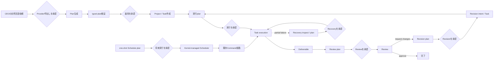
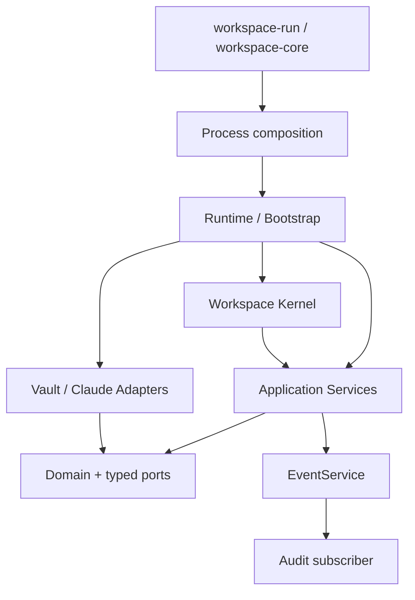

# Workspace OS System Overview

## Workspace OSとは

Workspace OSは、会社、AI社員、Project、Task、成果物、Review、Revision、監査証跡を、人間が読めるWorkspaceと型付きの実行系で一貫して扱うシステムです。現在の製品RuntimeはGo Onlyです。正本の運用入口は`workspace-run`、中核のビジネスルールはGo Domain／Service、運用データはVault Adapterが管理します。

この文書は「現在どう動くか」を説明します。不変条件は[CONSTITUTION.md](CONSTITUTION.md)、個別判断の理由は[ADR](adr/)、詳細なpackage構造は[Architecture.md](Architecture.md)、HTTP運用は[HTTPAPI.md](HTTPAPI.md)、今後の順序は[ROADMAP.md](ROADMAP.md)を正とします。

## 外側から見た利用フロー

1. CEO依頼は、構造化Employee inventoryとProvider-neutralなPromptからtyped planへ変換します。
2. Provider出力は未知field、未知社員、不正な依存、循環依存をGoで拒否します。生成と適用は分離され、LLM出力を直接Vaultへ書きません。
3. 承認済みplanだけがGo Project／Task writerへ渡り、Project、Task、Task Dependenciesを作成します。承認済みReviewed Workflow commandはdependency readinessをTaskごとに再planし、各TaskをReviewして、Request ChangesならRevision Taskを実行・再Reviewしてから本流へ戻ります。
4. 通常Taskはread-only planで対象、依存、既存成果物を確認した後、別の明示承認で実行します。主要な副作用commandは、Command IDを指定すると副作用前にdurable claimを保存し、同一requestの完了応答を再送しても処理を重複実行しません。
5. Workerは構造化ContextからPromptを作り、Runner RegistryがProvider Adapterを選びます。RunnerはTask状態や保存形式を知りません。
6. 成果物を保存してからTaskを完了します。Reviewはcanonical JSON、Markdown表示、Eventの順で成立させます。
7. Reviewが修正を要求した場合は、immutable Revision intentを保存してからTaskServiceで修正Taskを作成します。

各副作用commandは`--approved`がなければ、Vault I/O、Provider設定読取、HTTP client生成より前に拒否されます。plan／inspect／validateは副作用を持ちません。

## 実行時の層

| 層 | 現在の責務 | 入れてはいけないもの |
|---|---|---|
| Kernel | Service登録、起動停止、Command調停 | Prompt本文、Markdown、Provider設定、Task規則 |
| Domain | Task、Workflow、Policy、Organization、Review等の決定的な型とルール | Vault I/O、SDK、`.env`、ネットワーク |
| Service | Domainとportの実行順、Scheduler時刻調停、型付きResult／Error | Provider固有transport、Markdown形式 |
| Adapter | Vault形式、atomic file operation、Anthropic HTTP変換 | Task状態変更、承認判断、Audit直書き |
| Runtime／Process | 具体Adapterの注入、Event subscriber接続、CLI境界 | 新しいビジネスルール |

GoのRelease Gateは、Domain／Service／KernelからAdapter／Runtime／Processへの逆向き依存を禁止します。CoreはObsidian、Vault path、Anthropic、APIキー、`.env`、Python runtimeを知りません。

## Task、Event、Audit

Task状態の正本はTask Domain、状態変更の唯一の入口はTaskServiceです。`Create`、`Start`、`Complete`、`Fail`、`Hold`、`Resume`はVersion/CASで永続化し、対応するTask lifecycle EventもTaskServiceだけが生成します。

Worker、Runner、Execution、Review、Revision、Vault AdapterはTask状態を直接変更しません。Executionの失敗事実は`Fail`、その後の運用判断はExecutionPolicy、必要な保留は`Hold`として分離します。

Task、Review、Revision Eventはclosed typed eventです。EventServiceはin-process、同期、at-most-onceで配信します。AuditはEvent subscriberとしてだけ接続され、ServiceやStoreはAudit Markdownを直接書きません。永続queue、再配送、Outboxは現在の保証ではありません。

## OrganizationとIdentity

社員名は表示情報、社員IDは永続参照です。Task、Review、Revision、Event、AuditはIDで関連付けます。Go Organization Domainは社員Markdown、Workspace Manager、予約Identityからinventoryを作り、重複ID、氏名policy、参照整合性を検証します。

採用、改名、ID repair、Workspace State同期はplanとexecuteを分離します。複数ファイルにまたがる更新は、最初のcanonical commit後に失敗し得るため、成立済み段階をpartial resultとして返し、自動rollbackや推測修復を行いません。

## Vault persistence

Vaultは現在の運用データの正ですが、Go Coreからはport越しに扱います。

- `Tasks.md`: 既存5列を人間向け表示、managed HTML comment内JSONをGo Task DomainのVersion、reason、digestの正とする
- `Deliverables/`: Task完了より先にimmutable成果物をcommitする
- `Reviews/`: immutable canonical JSONをReview factのcommit pointとし、Markdownを後続projectionとする
- `Revisions/`: immutable intentをTask作成より先にcommitする
- `Audit Log.md`: Event subscriberが既存互換の人間可読履歴を追記する
- `社員/`、`会社/Workspace State.md`: Employee identityをcanonical、会社一覧をprojectionとして扱う
- `.workspace-os/schedules/`: 承認済みone-shot Command、due time、Version／CAS、dispatch／terminal stateを持つmachine metadata

単一ファイルは同一directoryのtemporary file、flush／sync、rename、directory syncで置換します。既存immutable artifactは上書きしません。Task表とmanaged metadataの欠落、破損、重複、不整合は推測せず拒否します。複数ファイル操作はtransactionではないため、各ADRのcommit orderingとpartial stateが回復判断の根拠です。

## Approvalとfailure model

承認前は副作用ゼロです。承認後も失敗を成功として隠しません。

| 処理 | commit順 | 後続失敗時 |
|---|---|---|
| Task mutation | Store → lifecycle Event | 保存済みTaskを返すpublication partial failure |
| Execution | Start → Worker → Deliverable → Complete | Deliverableは削除せずpartial failure |
| Worker／Deliverable失敗 | Fail → ExecutionPolicy → 必要ならHold | 各失敗段階を型付きで保持 |
| Review | canonical JSON → Markdown → Review Event | JSON commit後はReview fact成立。projection／publication失敗を明示 |
| Revision | immutable intent → TaskService.Create → Revision Event | 成立済みintent／Taskを削除しない |
| Organization writer | ADRで定めたcanonical commit → projection | commit済み段階をResultに保持 |
| Recovery | read-only evidence → plan再検証 → TaskService | stale evidenceを拒否し、成立済みartifactを保持 |
| Scheduler | pending Schedule → dispatching CAS → target Command Ledger → terminal Schedule | target factをrollbackせず、曖昧なdispatchingを自動resumeしない |

retry時に既存artifactを推測してadoptせず、自動削除・上書きもしません。ADR-0020のRecovery foundationは、再起動後のTask／Deliverable／Review／Revision／Audit／temporary stateをread-onlyで診断します。確定証拠に拘束した`complete_task`と`fail_and_hold_task`だけを、plan再検証、明示承認、Task CASを経て実行します。Event replay、Review／Revision reconciliationは行いません。運用詳細は[Recovery.md](Recovery.md)を参照してください。

ADR-0021のCommand Ledger foundationは、明示Command ID付き通常Task／Review／Revision、CEO apply、Project／Task writer、Organization writer、Sequential／Reviewed Workflow executionで、`running` claimを業務副作用より先にcommitします。同じID・digestのterminal outcomeは保存済みResultを返し、異なるdigestは拒否します。Project作成前とOrganization commandはworkspace scope、既存Project内commandはproject scopeへ記録します。`running` recordはcrashか実行中かを推測せず、Recoveryで診断して自動resumeしません。

ADR-0025のSchedulerは、明示承認されたone-shot `workspace-command.v1`を`.workspace-os/schedules`へ保存します。dueまたはmissed tickではScheduleを`dispatching`へCAS commitしてから、同じtarget Command ID／payloadを既存Processへ渡します。targetのTask／Review／Revision／Audit規則を再実装せず、crash後の`dispatching`、failure、recovery requiredをread-only inspectionへ残します。

## Go Only RuntimeとPython compatibility

製品のbuild、plan、CEO plan、Project／Task管理、Organization／Identity、Task execution、Review、Revision、Deliverable、Audit、one-shot SchedulerにPython interpreterは不要です。CLIに加え、loopback既定の`workspace-daemon`は必須Command IDの`workspace-command.v1`を同じGo process／Serviceへ渡します。Go sourceが外部interpreterを起動しないことをRelease Gateで検査します。

Python v0.1 packageは公開利用者向けcompatibility surfaceとしてだけ残します。既存import pathと`workspace-ai` entry pointを維持しますが、製品Runtimeではありません。Python gatewayはGo JSON v1 processへ明示的に接続し、失敗時にPython Worker、Provider、writerへfallbackしません。legacy moduleは新規機能追加禁止のreference実装です。

製品Runtimeの判定は[GoOnlyReleaseGate.md](GoOnlyReleaseGate.md)、Pythonの分類と物理削除条件は[PythonRuntimeInventory.md](PythonRuntimeInventory.md)を参照してください。

## 現在の意図的な限界

- Event配送は永続化されず、process crash後の自動再配送はない。欠落は原因不明として診断する
- 既存artifactを使った自動retry／adoption／projection再構成はない。安全なTask partial stateだけ明示Recoveryできる
- Durable Command判定は明示Command ID付き主要writerへ適用済み。ID未指定実行と専用migration／Recovery操作は再送保証を持たない
- 複数Task orchestrationはboundedな同期runであり、durable queueや自動resumeはない
- HTTP daemonのremote公開、認証／TLS、非同期queueは未実装。現在はloopback同期Command APIだけ
- Reviewed Multi-task WorkflowはTaskごとにReviewし、Request ChangesならRevision Taskを実行・再Reviewする。自動resume、並列実行は未実装
- Schedulerはone-shotだけで、cron／recurrence、並列配送、`dispatching` reconciliationは未実装
- 外部Action Adapterはまだ製品入口ではない
- Python compatibility APIは公開互換方針が終了するまでrepositoryに残る

これらはGo Only Runtimeの不足ではなく、次期Roadmapで段階的に扱う耐久性・運用機能です。
