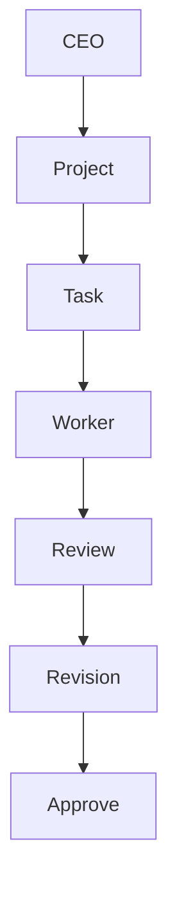

# Workflow

## 概要

製品Runtimeでは`workspace-run`とGo process／ServiceがTask execution、Review、Revisionを提供します。Sequential Workflowは実行可能Taskを順次処理し、Reviewed Workflowは各Task後のReview／Revision分岐を既存Serviceで調停します。

Mermaidソース: [workflow.mmd](workflow.mmd)

## 1タスクの処理順序

1. Workflow processが最初の実行可能Taskをread-onlyで選びます。
2. Process境界が明示的承認を確認します。
3. Vault Context AdapterとExecutionServiceが担当社員ID、Task状態、成果物未作成を検証します。
4. Go WorkerServiceがPromptBuilder、Runner Registry、Runner Adapterを経由して実行します。
5. Go ExecutionServiceが成果物を先行commitし、TaskServiceだけがTaskを`完了`へ更新します。
6. Go Review processが別社員Contextで成果物をレビューします。
7. `Approve`ならreadinessを再評価して次のTaskへ進みます。
8. `Request Changes`ならGo Revision processが元担当社員向けの修正タスクを1件作り、実行・再Reviewします。

## タスク状態

| 状態 | 意味 |
|---|---|
| 未着手 | Go ExecutionServiceが実行可能 |
| 進行中 | Runner実行中 |
| 完了 | 成果物保存済み |
| 保留 | 失敗事実を受けたPolicy判断で停止。自動再実行しない |

未割当、存在しない社員ID、未着手以外のタスク、既存成果物があるタスクは実行できません。

## dry-runと承認

`workspace-run plan`は、プロジェクト、タスク、社員、依存、成果物予定パスを返します。Runner呼び出し、Provider設定読取、タスク状態変更、ファイル作成は行いません。

`workspace-run workflow-plan`は次の1 Taskだけをread-onlyで示します。`workflow-execute`は`--command-id`を必須とし、明示承認後に各Task完了ごとにreadinessを再評価して、既存の単一Task executionを順次呼びます。outer workflowと各child Taskは別のdurable Command recordを持ち、途中停止を自動resumeしません。

`workspace-run workflow-reviewed-plan`はreviewer IDと条件付きRevisionを含むbounded runをread-onlyで示します。`workflow-reviewed-execute`は1回の明示承認後、各TaskをReviewし、`Approve`なら次Task、`Request Changes`なら既存Revision orchestrationで修正Taskを作成して実行・再Reviewします。通常Taskの順序は変更せず、Revision Taskだけをimmutable Revision結果に基づくtargeted readinessで先行させます。Task、Review、Revisionには役割別の決定的child Command IDを使い、partial failureや`running`を自動resumeしません。

本実行には明示承認が必要です。承認がなければ`approval_required`を返して停止します。

## 失敗時の挙動

- Runner失敗: TaskService.Failで事実を記録し、ExecutionPolicyの判断後、必要ならTaskService.Holdを実行する。未commitの成果物は成功扱いしない
- Go execution失敗: Workflowはレビューを呼ばず`task_execution`段階で停止
- Go Review失敗: 完了済みタスクと成果物、commit済みReview evidenceを保持し、修正タスクを作らず`review`段階で停止
- Go Revision失敗: Reviewとcommit済みintent／Taskをrollbackせず、部分状態を保持して`revision_task_creation`段階で停止

Workflow resultは停止段階、現在のタスク状態、エラー種別、短い概要をWorkspace Managerへ返します。

## 二重実行防止

Go TaskServiceとVault TaskStoreは永続Version/CASで同一Taskの競合を拒否します。Execution planはTask状態、依存、既存成果物を副作用なしで確認します。process内lockを永続的な正しさの根拠にはしません。
