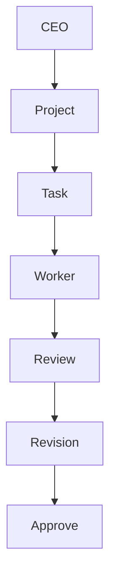

# Workflow

## 概要

WorkflowEngineはWorkspace Managerから各コンポーネントを呼び出し、最初の未着手タスクを1件だけ処理します。各コンポーネントの既存APIは変更せず、順序と停止条件だけを管理します。

Mermaidソース: [workflow.mmd](workflow.mmd)

## 1タスクの処理順序

1. ProjectManagerが最初の`未着手`タスクを取得します。
2. WorkflowEngineが明示的承認を確認します。
3. TaskExecutorが担当社員ID、タスク状態、成果物の未作成を検証します。
4. Workerが担当社員を読み込み、PromptBuilderとModelRouterを経由してRunnerを実行します。
5. TaskExecutorが成果物を`Deliverables/<TASK-ID>.md`へ保存し、タスクを`完了`へ更新します。
6. ReviewerWorkerが別社員で成果物をレビューします。
7. `Approve`なら次の未着手タスクIDを返します。次タスクはこの呼び出しでは実行しません。
8. `Request Changes`ならRevisionTaskServiceが元担当社員向けの修正タスクを1件作ります。

## タスク状態

| 状態 | 意味 |
|---|---|
| 未着手 | TaskExecutorが実行可能 |
| 進行中 | Runner実行中 |
| 完了 | 成果物保存済み |
| 保留 | Runner失敗。自動再実行しない |

未割当、存在しない社員ID、未着手以外のタスク、既存成果物があるタスクは実行できません。

## dry-runと承認

`TaskExecutor.execute(..., dry_run=True)`は、プロジェクト、タスク、社員、Runner、成果物予定パスを返します。Runner呼び出し、タスク状態変更、ファイル作成は行いません。

本実行には`approved=True`が必要です。WorkflowEngineにも承認を渡さない場合、`approval_required`を返して停止します。

## 失敗時の挙動

- Runner失敗: 不完全な成果物を削除し、タスクを`保留`へ変更してProgress.mdへ概要を記録
- TaskExecutor失敗: WorkflowEngineはレビューを呼ばず`task_execution`段階で停止
- ReviewerWorker失敗: 完了済みタスクと成果物を保持し、修正タスクを作らず`review`段階で停止
- RevisionTaskService失敗: レビューを保持し、`revision_task_creation`段階で停止

WorkflowEngineは停止段階、現在のタスク状態、エラー種別、短い概要をWorkspace Managerへ返します。

## 二重実行防止

TaskExecutorはタスク単位のロックファイルを使用し、ロック取得後に状態と成果物を再検証します。完了済みタスク、既存成果物、同時実行中タスクは拒否されます。
